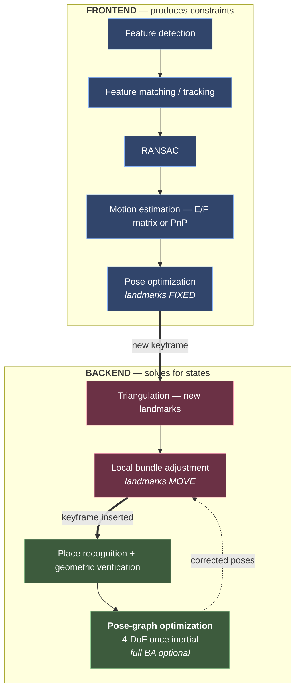
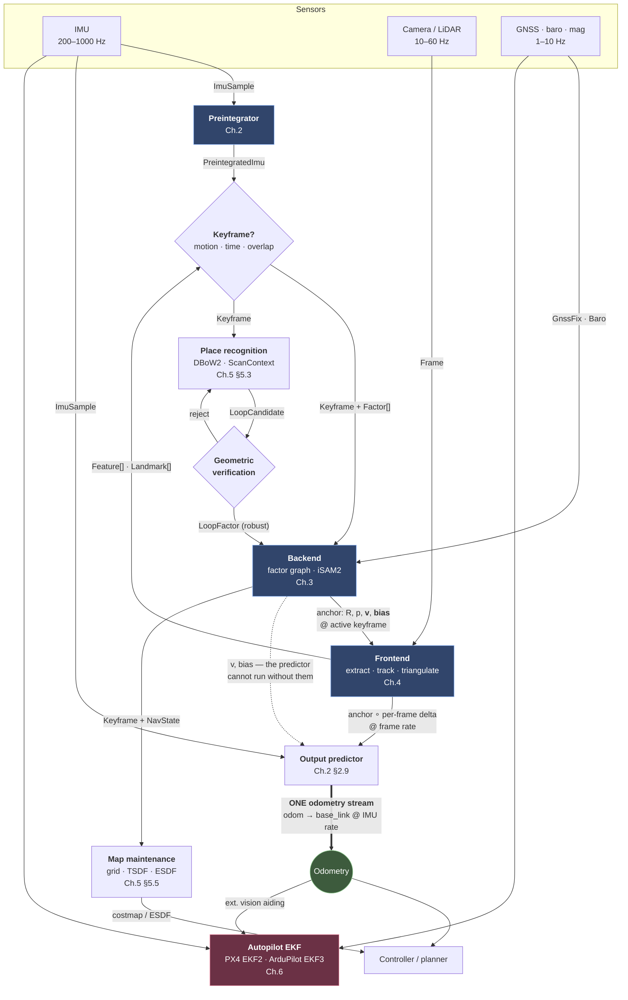
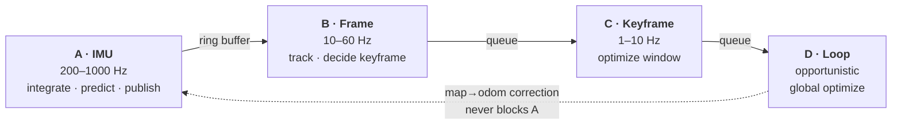
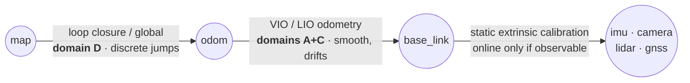
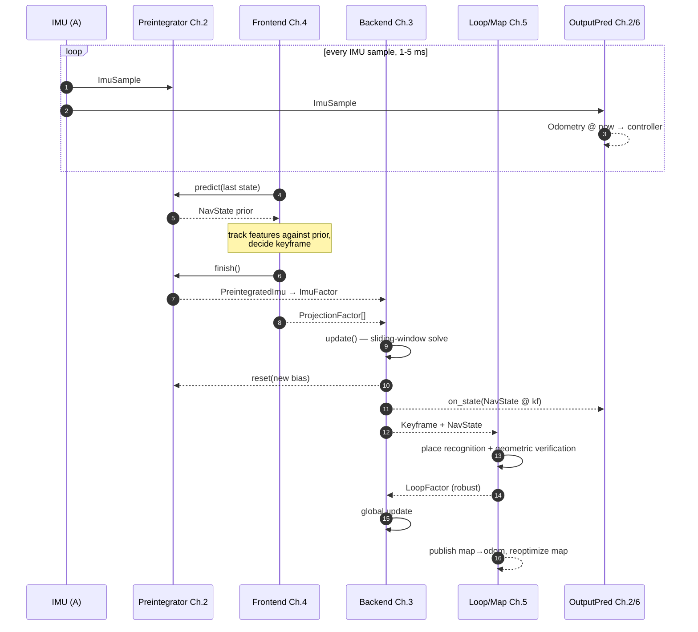

# Chapter 1 — System Architecture: components, interfaces, data flow

Every chapter after this one zooms into a single box. This chapter fixes what the boxes are, what runs between them, and — the part usually left implicit — **the type of the thing on each wire**. Read the rest as decomposition: when Chapter 2 derives $\Delta\tilde{\mathbf{R}}_{ij}$, it is populating one field of one message defined here.

Two organising claims. First, **there is one algorithmic backbone** — the VO chain of §1.1 — and every system in Chapters 4 and 5 is a variation on it; the rest is implementation detail. Second, as a *running system* it is four rate domains connected by queues, and almost every architectural mistake is either putting a component in the wrong rate domain or letting a slow domain block a fast one.

## 1.1 The backbone: VO, then VIO

Before any architecture, the algorithm. Every system in this document is a variation on one chain, and it is worth having that chain in mind before the boxes and wires of §1.2 — because the boxes exist to serve it.

**Read the left column alone and it is pure visual odometry. Read the whole figure and it is VIO** — the inertial half never replaces a stage, it feeds into them.

```
 Camera images                                   IMU @ 200-1000 Hz
       │                                                │
       ▼                                                ▼
 Feature detection                    ┌─────────────────────────────────┐
 ORB · SIFT · FAST · Shi-Tomasi       │        PREINTEGRATION           │
       │                              │   ΔR, Δv, Δp, Σ                 │
       │                              │   + 5 bias Jacobians    (Ch.2)  │
       │                              └────────────────┬────────────────┘
       ▼                                               │
 Feature matching / tracking ◄──── rotation prior ─────┤
       │                                               │
       ▼                                               │
 RANSAC ◄───────────────────────── better inlier ratio ┤
       │                         (not a smaller solver)│
       ▼                                               │
 Motion estimation ◄────────────── initial guess ──────┤
 E / F matrix, or PnP               + metric scale     │
       │                                               │
       ▼                                               │
 Pose optimization ◄────────────── IMU factor ─────────┤
       │                            state gains v,bias │
       ▼                                               │
 Triangulation / mapping                               │
       │                                               │
       ▼                                               │
 Bundle adjustment ◄────────────── IMU factor chain ───┤
       │                            → VI-BA            │
       ▼                                               │
 Loop closure ◄─────────────────── 6-DoF / Sim(3) ─────┘
                                    collapses to 4-DoF

 └──────── this column alone: VO ────────┘
 └────────────────────── the whole figure: VIO ──────────────────────┘
```

Everything after this chapter is an implementation detail of that figure. Note what the inertial side does *not* touch: **feature detection**, which stays purely photometric.

| Stage | What inertial data changes |
|---|---|
| Feature detection | **Nothing** — it is purely photometric |
| Feature matching | A rotation prior shrinks the search window (*guided matching*) |
| RANSAC | **Indirectly, and more powerfully than the textbook claim** — see the note below |
| Motion estimation | A good **initial guess** (Gauss-Newton is local, so this often decides convergence) and, for monocular, **metric scale** |
| Pose optimization | Pose-only BA becomes *inertial*: the state grows from a 6-DoF pose to pose + velocity + biases |
| Triangulation | Indirectly, via better poses; gravity also pins two rotational DoF of the whole map |
| Bundle adjustment | **The main event** — IMU factors chain consecutive keyframes ([§4.2](chapter-4.md)) |
| Loop closure | Roll and pitch become observable, so pose-graph optimization drops to **4 DoF** — x, y, z, yaw |

### Frontend, backend, and the three tiers

The chain above is one *sequence*, but it does not run at one *rate* or in one *thread*. Two cuts matter, and they are orthogonal:

- **Frontend vs backend** — who *produces constraints* (data association) versus who *solves for states* (optimization).
- **Tier** — how often a stage runs: every frame, every keyframe, or only when a loop is detected.



| Colour | Tier | Rate | What moves |
|---|---|---|---|
| **blue** | 1 — per frame | 10–60 Hz | the current pose only |
| **red** | 2 — per keyframe | 1–10 Hz | a window of poses **and** landmarks |
| **green** | 3 — on loop detection | seconds–minutes | all poses in the graph |

**Is that the right separation?** Structurally yes — it is the same cut as rate domains **B**, **C** and **D** in §1.4. Two refinements are worth making:

**Loop closure is pose-graph optimization, not global BA.** Landmarks are marginalized into relative pose constraints and only poses are solved, which is what makes it affordable on a large map. A full BA afterwards is *optional and rare*: ORB-SLAM3 spawns `GlobalBundleAdjustemnt` / `FullInertialBA` in yet another thread, but **VINS-Fusion never does one** — `loop_fusion` runs `optimize4DoF()` and stops — and cuVSLAM exposes no full BA either. So calling tier 3 "global BA" overstates what two of the three actually run.

**There is a tier below all of these.** The output predictor of §1.5 runs at **IMU rate**, 200–1000 Hz, faster than tier 1, and it is neither frontend nor backend — it consumes the backend's state and produces the odometry the controller reads. That is rate domain **A**.

The frontend/backend line is worth one caution too: *pose optimization* sits right on it. It is optimization mathematics, but it runs in the tracking thread with landmarks held fixed, so by convention it belongs to the frontend — ORB-SLAM3's own naming puts `Tracking` (which calls `PoseOptimization`) on the frontend side and `LocalMapping` / `LoopClosing` on the backend side. The honest boundary is not "is it an optimizer" but **"is it allowed to change the map"** — and that is exactly the tier-1/tier-2 distinction in the table above.

!!! warning "What the IMU does *not* do to RANSAC"
    The textbook claim is that a known rotation shrinks the minimal sample — 5-point becomes 2-point — and since iterations go as $N = \log(1-p)/\log(1-w^s)$, a smaller $s$ buys speed. Solvers of that kind do exist.

    **Neither VINS-Fusion nor cuVSLAM uses one.** VINS runs plain `cv::findFundamentalMat(..., cv::FM_RANSAC, ...)` in both `feature_tracker.cpp` and `solve_5pts.cpp`; cuVSLAM's RANSAC lives in loop closure and relocalization, not the per-frame path at all.

    What the IMU actually buys is a **higher inlier ratio $w$** going in, because predicted feature positions make KLT converge to the right minimum. And $w$ dominates $s$:

    | | iterations at $p = 0.99$ |
    |---|---|
    | $s=5$, $w=0.5$ | **145** |
    | $s=2$, $w=0.5$ — smaller minimal set | 16 |
    | $s=5$, $w=0.8$ — better matches | **12** |

    Improving the matches beats shrinking the solver. The gain is real; it just arrives through the matching stage rather than inside RANSAC.

### Why *preintegration*, and not just "integrate the IMU"

Raw integration depends on the pose you start from, so every time the optimizer nudges a pose you would re-integrate every sample between keyframes. Preintegration removes that dependency, and in doing so changes what the IMU *is*:

```
   (x_i) ──[reprojection]── (landmark)      the visual pipeline already had edges
   (x_i) ──[IMU factor]──── (x_j)           now the IMU is one too
```

That is the whole trick. It makes inertial data fit the **same optimization machinery** the visual chain already used — no new solver, no new data structure, one more factor type. Chapter 2 derives it; [Chapter 3](chapter-3.md) is the machinery it plugs into.

### Three stages with no pure-VO analogue

1. **Initialization.** Gravity direction, metric scale and initial biases must be estimated before the IMU is usable at all. Every implementation has a dedicated stage for it ([§4.3](chapter-4.md), [§4.4](chapter-4.md), [§4.5](chapter-4.md)).
2. **Bias estimation, continuously.** Biases drift, so they stay in the state forever — which is the entire reason the bias Jacobians of [§2.6](chapter-2.md) exist.
3. **High-rate output.** The optimizer produces a pose at the last keyframe, 50–100 ms stale; forward-propagating raw IMU gives the controller a pose *now*. This is the `OutputPredictor` of §1.5 and the reason domain **A** in §1.4 exists.

And one bonus that is not a stage but saves systems in the field: when vision fails — motion blur, a featureless wall — inertial dead reckoning bridges the gap instead of forcing a relocalization from scratch.

> Pure VO estimates a **trajectory**. Adding an IMU means estimating a **state** — pose, velocity, biases, gravity — and preintegration is what lets you do that without changing the optimizer.

## 1.2 The system on one page



**One odometry stream leaves the system — the stages are in series, not in parallel.** This is worth being emphatic about, because drawing three producers pointing at a controller is a real architectural error, not just a messy diagram: a consumer must have exactly one authority on where the robot is.

What the three stages actually do is *extend the same estimate forward in time*, each starting where the previous one stopped:

| Stage | Answers | Rate | Adds |
|---|---|---|---|
| **Backend** | "where was I *accurately*, at the last keyframe" | 1–10 Hz | the anchor: R, p, **v, bias** — 50–100 ms stale |
| **Frontend** | "how far have I moved *since* that keyframe" | 10–60 Hz | a per-frame delta composed onto the anchor |
| **Output predictor** | "and where am I *right now*" | 200–1000 Hz | IMU propagation from the freshest available state |

Read down that table and it is one sentence: the backend supplies a trustworthy but stale origin, the frontend carries it forward to the current frame, and the output predictor carries it forward to the current instant. Only the last one publishes.

This is also why the anchor must come from the **backend** rather than the frontend, which is the objection the figure invites. It is not about freshness — it is about content. Propagating the IMU requires **velocity**, because position integrates through it, and both **biases**, because raw samples must be corrected first. A frontend PnP result is a pose and nothing else, so it can refine *where* the anchor has moved to, but it cannot serve as one.

In the implementations: cuVSLAM's `Odometry::State` carries `Pose delta` — explicitly *"pose change since last keyframe"* — which is the frontend row, composed onto the optimized keyframe pose ([§4.4](chapter-4.md)). VINS-Fusion's `updateLatestStates()` copies `Ps/Rs/Vs/Bas/Bgs[frame_count]` from the newest optimized state and only then can `fastPredictIMU()` run per IMU sample, publishing through the single `pubLatestOdometry()` ([§4.5](chapter-4.md)). Neither publishes two competing odometries.

Where you *tap* that chain is a design choice — publish at frame rate and skip the predictor if the controller is slow — but it is a choice of one tap, not of several.

Note the two extra arrows into the autopilot EKF: it receives the **same IMU stream** the preintegrator consumed, *and* the odometry derived from it. That double path is not a mistake in the drawing — it is a real, widely-shipped architecture, and §6.9 is about what it costs you.

## 1.3 The types on the wires

This is the contract. Every later chapter produces or consumes one of these; nothing else crosses a component boundary.

| Type | Fields | Produced by | Consumed by |
|---|---|---|---|
| `ImuSample` | $t$, $\tilde{\boldsymbol{\omega}}$ [rad/s], $\tilde{\mathbf{a}}$ [m/s²] | IMU driver | Preintegrator (Ch.2), output predictor, autopilot EKF (Ch.6) |
| `Frame` | $t_{\text{mid}}$, image(s), intrinsics, extrinsics | camera / LiDAR driver | Frontend (Ch.4) |
| `PreintegratedImu` | $\Delta\tilde{\mathbf{R}}, \Delta\tilde{\mathbf{v}}, \Delta\tilde{\mathbf{p}}$, $\boldsymbol{\Sigma}_{ij}$, $\partial\Delta/\partial\mathbf{b}$ (×5), $\bar{\mathbf{b}}$, $\Delta t_{ij}$ | **Preintegrator (Ch.2)** | Backend, as `ImuFactor` (Ch.3 §3.5) |
| `NavState` | $\mathbf{R}, \mathbf{p}, \mathbf{v}$ — an element of $SE_2(3)$ — plus bias $\mathbf{b}$ | Backend (Ch.3) | Frontend prediction, output predictor, preintegrator reset |
| `Feature` | pixel, descriptor, track id, pyramid level | Frontend (Ch.4 §4.3) | Data association, triangulation |
| `Landmark` | id, $\mathbf{X}_W$, descriptor, observation list | Frontend triangulation | Backend (Ch.3), map, place recognition |
| `Keyframe` | id, $t$, `NavState`, `Feature[]`, `Landmark` refs | Keyframe selector | Backend, place recognition, map |
| `Factor` | variable keys, residual $\mathbf{r}$, noise model $\boldsymbol{\Sigma}$ | every frontend | **Backend (Ch.3)** |
| `LoopCandidate` | query kf, match kf, $\mathbf{T}_{\text{rel}}$, fitness score | Place recognition (Ch.5 §5.3) | Geometric verification → robust `Factor` |
| `Odometry` | $t$, pose, twist, $\boldsymbol{\Sigma}$, `frame_id` / `child_frame_id` | Output predictor | Controller, autopilot EKF (Ch.6 §6.9) |
| `MapUpdate` | submap / grid / TSDF / ESDF delta | Map maintenance (Ch.5 §5.5) | Planner, costmap |

Two conventions worth stating once, because violating either is a *class* of bug rather than a single one:

- **Every pose-like type carries its frame pair explicitly.** An `Odometry` without `frame_id`/`child_frame_id` is not a pose, it is a rumour. §1.7 fixes which pair each component may emit.
- **Every measurement-like type carries its covariance**, always expressed in the tangent space at the mean (§0.4). A `PreintegratedImu` without $\boldsymbol{\Sigma}_{ij}$ cannot be weighted, and an unweighted factor silently dominates the graph.

## 1.4 Rate domains

Four clocks. The boundary between them is always a queue, never a function call.



| Domain | Period | Must never | Because |
|---|---|---|---|
| **A** IMU | 1–5 ms | allocate, lock, or wait | the only path with a hard real-time deadline — the controller consumes it |
| **B** Frame | 16–100 ms | wait on the backend | dropping a frame loses tracking; frames must be processed or explicitly skipped |
| **C** Keyframe | 0.1–1 s | wait on loop closure | a large closure can take seconds; local odometry must not stall behind it |
| **D** Loop | seconds–minutes | write state that A reads directly | its corrections are discrete jumps; they belong on `map→odom` |

The most common architectural failure in a first SLAM implementation is calling the backend synchronously from the frame callback — coupling domain B to domain C, so tracking hiccups exactly when the optimizer is working hardest.

## 1.5 Component interfaces

Signatures only. Each is implemented by the chapter named on the right.

```
Preintegrator                                                    Chapter 2
    integrate(ImuSample)                    -> ()                  §2.8
    predict(NavState, Bias)                 -> NavState            §2.4
    finish()                                -> PreintegratedImu    §2.4
    reset(Bias)                             -> ()                  §2.6
    correct(PreintegratedImu, Bias)         -> PreintegratedImu    §2.6

Frontend                                                         Chapter 4
    process(Frame, NavState prior)          -> Feature[]           §4.3
    associate(Feature[], Landmark[])        -> Match[]             §4.1
    triangulate(Match[], NavState[])        -> Landmark[]          §4.2
    is_keyframe(Frame, Match[])             -> bool                §4.3

Backend                                                          Chapter 3
    add(Factor[])                           -> ()                  §3.1
    update(Values initial_guess)            -> Values              §3.4
    marginalize(Key[])                      -> ()                  §3.3
    at(Key)                                 -> NavState            §3.5

PlaceRecognition                                                 Chapter 5
    insert(Keyframe)                        -> ()                  §5.3
    query(Keyframe)                         -> LoopCandidate[]     §5.3
    verify(LoopCandidate)                   -> Factor | reject     §5.4

MapMaintenance                                                   Chapter 5
    insert(Keyframe, NavState)              -> ()                  §5.5
    reoptimize(Values)                      -> MapUpdate           §5.6
    query_esdf(point)                       -> (distance, grad)    §5.5

OutputPredictor                                              Chapters 2 and 6
    on_state(NavState @ t_kf)               -> ()                  §2.9
    on_imu(ImuSample)                       -> Odometry @ now      §2.9 / §6.4
```

!!! tip "This split is not hypothetical"
    NVIDIA's cuVSLAM ships exactly this division as its public API: a `cuvslam::Odometry` class (frontend, domains A–C) whose `Track()` returns a pose estimate, and a `cuvslam::Slam` class (backend, domain D) whose `Track()` **takes an `Odometry::State`**. That struct — relative pose delta, keyframe flag, observations, landmarks, optional gravity — is a real instance of the §1.3 contract. See [§4.4](chapter-4.md).

`OutputPredictor` appears twice deliberately. It is the same idea in both halves of this document — integrate raw IMU forward from a stale optimized state to produce a current one — and PX4's version (§6.4) is the mature implementation of what §2.9 sketches.

## 1.6 Top-level pseudocode

The whole system, with every call resolving to an interface above. Later chapters replace a single line here with a section.

```
# ═══════ domain A — IMU rate, 200-1000 Hz, hard real-time ═══════
on imu_sample(s: ImuSample):
    imu_buffer.push(s)
    preint.integrate(s)                            # Ch.2 §2.8
    state_now = output_pred.on_imu(s)              # Ch.2 §2.9
    publish(Odometry(state_now, "odom", "base_link"))

# ═══════ domain B — frame rate, 10-60 Hz ═══════
on frame(f: Frame):
    prior   = preint.predict(last_kf.state, last_kf.bias)     # Ch.2 §2.4
    feats   = frontend.process(f, prior)                      # Ch.4 §4.3
    matches = frontend.associate(feats, local_map.landmarks)  # Ch.4 §4.1
    if matches.empty():
        relocalize() or atlas.new_map();  return              # Ch.4 §4.3
    if not frontend.is_keyframe(f, matches): return
    kf_queue.push(Keyframe(f, feats, matches, prior))         # → domain C

# ═══════ domain C — keyframe rate, 1-10 Hz ═══════
loop:
    kf = kf_queue.pop()

    imu_meas = preint.finish()                                # PreintegratedImu
    preint.reset(bias = last_kf.bias)                         # Ch.2 §2.6 — critical

    factors  = [ ImuFactor(last_kf.key, kf.key, imu_meas) ]           # Ch.3 §3.5
    factors += [ ProjectionFactor(kf.key, m) for m in kf.matches ]    # Ch.4 §4.1
    if gnss.ready(): factors += [ GnssFactor(kf.key, gnss.pop()) ]    # Ch.3 §3.5

    backend.add(factors)                                      # Ch.3 §3.1
    values  = backend.update(initial_guess = imu_meas.predict(last_kf.state))
    last_kf = kf.with_state(backend.at(kf.key))               # Ch.3 §3.4

    output_pred.on_state(last_kf.state)                       # hand back to domain A
    map.insert(kf, last_kf.state)                             # Ch.5 §5.5
    place_rec.insert(kf);  loop_queue.push(kf)                # → domain D

# ═══════ domain D — loop closure, opportunistic, async ═══════
loop:
    kf = loop_queue.pop()
    for cand in place_rec.query(kf):                          # Ch.5 §5.3
        factor = place_rec.verify(cand)                       # Ch.5 §5.4
        if factor is reject: continue
        backend.add([factor])                                 # robust kernel — Ch.3 §3.6
        values = backend.update()
        publish_map_to_odom(values)                           # a TF, not odometry
        map.reoptimize(values)                                # Ch.5 §5.6
```

Four invariants this skeleton exists to enforce:

1. **`preint.reset()` runs exactly once per keyframe, with the newly optimized bias.** Forget it and the next interval integrates against a stale linearization point (Ch.2 §2.6).
2. **The backend's initial guess comes from the IMU prediction, never from identity.** Gauss-Newton is local (Ch.3 §3.6).
3. **Loop closure writes `map→odom`, never the odometry stream.** Domain A must never see a discrete jump (§1.7).
4. **Domain C hands state *back* to domain A** through `output_pred.on_state()`. Without that arrow the high-rate output slowly diverges from the optimized trajectory.

## 1.7 Frames — who owns which TF edge

REP-105, and it is an ownership question, not a naming one.



| Edge | Owner | Property the consumer relies on |
|---|---|---|
| `map → odom` | loop closure / global optimizer (domain D) | **may jump**; corrects accumulated drift |
| `odom → base_link` | VIO/LIO + output predictor (domains A, C) | **continuous and smooth**; drifts without bound |
| `base_link → sensor` | calibration | static, or slowly varying and only if observable |

The point of the two-layer split is that a controller consumes `odom→base_link` and therefore never sees a loop-closure step. Collapsing the layers — publishing the globally corrected pose as odometry — is the `map→odom` jump failure of Ch.5 §5.8, and it is exactly why §6.9 says to send *odometry* to the autopilot rather than the loop-closed pose.

## 1.8 One keyframe, end to end

The same story as §1.6, in time order, showing which domain each step runs in.



## 1.9 Which chapter implements which box

| Component | Chapter | Produces | Consumes |
|---|---|---|---|
| Lie-group algebra used by all of them | [Ch.0](chapter-0.md) | Jacobians, $\oplus$/$\ominus$ | — |
| Preintegrator, output predictor | [Ch.2](chapter-2.md) | `PreintegratedImu`, `Odometry` | `ImuSample`, `NavState` |
| Backend / factor graph | [Ch.3](chapter-3.md) | `NavState`, `Values` | `Factor[]` |
| Frontend, VIO as a whole | [Ch.4](chapter-4.md) | `Feature[]`, `Landmark[]`, `Factor[]` | `Frame`, `NavState` |
| Place recognition, map, lifelong ops | [Ch.5](chapter-5.md) | `LoopCandidate`, `MapUpdate`, `map→odom` | `Keyframe`, `Values` |
| Autopilot EKF — the *other* estimator | [Ch.6](chapter-6.md) | fused state → controller | `ImuSample`, `Odometry`, GNSS/baro/mag |

If a later chapter ever seems to appear from nowhere, come back to §1.2 and find its box: the wire going in and the wire coming out are its entire contract with the rest of the system.
