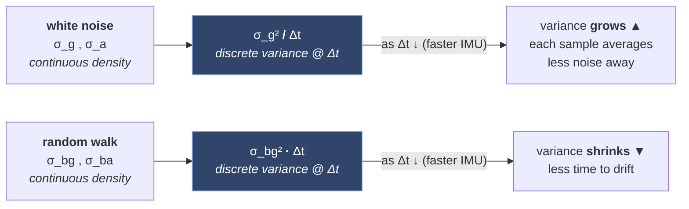
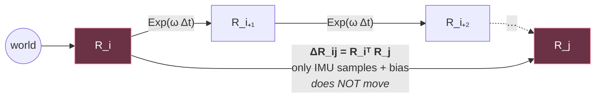
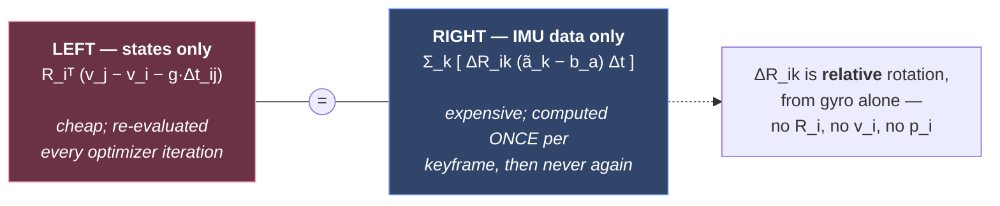
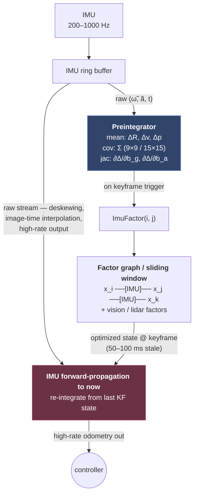

# Chapter 2 — IMU Preintegration

!!! abstract "Implements"
    **`Preintegrator` and `OutputPredictor` (§1.4).** Consumes `ImuSample`, produces `PreintegratedImu` and the high-rate `Odometry`. Rate domains **A** and **C** of §1.3.


!!! note "Sources"
    The formulation here is Forster et al. (2015/2017), which is what GTSAM implements. The equations in this chapter have been cross-checked line-by-line against [Qiu Xiaochen's 《预积分总结与公式推导》](https://github.com/PetWorm/IMU-Preintegration-Propogation-Doc), a 25-page derivation that works through every algebraic step the papers compress. See [References → cross-check notes](references.md#cross-check-notes) for what that check confirmed and what it corrected.

## 2.1 Sensor model

World frame here is any inertial frame with gravity $\mathbf{g}$ (a vector, e.g. $[0,0,-9.81]^\top$ in ENU). This rests on a **static world assumption** that is worth stating out loud, because it is what separates this from classical strapdown INS: the Earth's rotation is neglected, $\mathbf{g}$ is taken constant in both magnitude and direction, and the world frame — normally the local-level frame at initialization — is treated as inertial. For MEMS-grade sensors over SLAM-scale distances and durations this is sound, since a MEMS gyro cannot observe Earth rate anyway. On a navigation-grade IMU, or over hundreds of kilometres, it is not, and you need the Coriolis and gravity-model terms that PX4 and ArduPilot carry in Chapter 6.

The IMU measures **specific force** — not acceleration — and angular rate in the body frame:

$$\tilde{\boldsymbol{\omega}}_t = \boldsymbol{\omega}_t + \mathbf{b}^g_t + \boldsymbol{\eta}^g_t\tag{2.1}$$

$$\tilde{\mathbf{a}}_t = \mathbf{R}_t^\top(\mathbf{a}_t - \mathbf{g}) + \mathbf{b}^a_t + \boldsymbol{\eta}^a_t\tag{2.2}$$

with biases modelled as Brownian motion (random walk):

$$\dot{\mathbf{b}}^g = \boldsymbol{\eta}^{bg}, \qquad \dot{\mathbf{b}}^a = \boldsymbol{\eta}^{ba}\tag{2.3}$$

Four noise parameters, all from **Allan variance**, not from the datasheet:

| Parameter | Symbol | Units |
|---|---|---|
| Gyro noise density | $\sigma_g$ | rad/s/$\sqrt{\text{Hz}}$ |
| Accel noise density | $\sigma_a$ | m/s²/$\sqrt{\text{Hz}}$ |
| Gyro bias random walk | $\sigma_{bg}$ | rad/s²/$\sqrt{\text{Hz}}$ |
| Accel bias random walk | $\sigma_{ba}$ | m/s³/$\sqrt{\text{Hz}}$ |

**Where these numbers come from.** Log a stationary IMU for several hours, compute the Allan deviation over averaging time $\tau$, and read the parameters off the slopes of a log-log plot:

$$\sigma_A^2(\tau) = \underbrace{\frac{N^2}{\tau}}_{\text{white noise}} + \underbrace{\frac{2\ln 2}{\pi}B^2}_{\text{bias instability}} + \underbrace{\frac{K^2\tau}{3}}_{\text{bias random walk}}\tag{2.4}$$

```
 σ_A(τ)
 [log]
   │
   │╲                                                          ╱
   │ ╲                                                        ╱
   │  ╲   slope −1/2                          slope +1/2     ╱
   │   ╲  WHITE NOISE                     BIAS RANDOM WALK  ╱
   │    ╲ N = σ_g , σ_a                    K = σ_bg , σ_ba ╱
   │     ╲                                                ╱
   │      ╲                                              ╱
   │       ╲                                            ╱
   │        ╲__                                      __╱
   │           ╲___                              ___╱
   │               ╲_____   slope 0        ____╱
   │                     ╲_______________╱
   │                        ▲ min = 0.664·B
   │                          BIAS INSTABILITY (flicker floor)
   │                          — NOT modelled by the ESKF —
   └────┬───────┬───────┬───────┬───────┬───────┬───────┬────► τ [log]
      0.01s   0.1s     1s      3s      10s    100s   1000s
                        ▲       ▲
                        │       └── read K here:  σ_A(3 s) = K
                        └────────── read N here:  σ_A(1 s) = N
```

How to read it physically: at **short $\tau$** you are averaging a handful of samples, so white noise dominates and averaging longer helps — the curve falls. At **long $\tau$** the bias has had time to wander, so averaging longer *hurts* — the curve rises. The minimum between them is the bias instability, the flicker floor, which a random-walk bias model does **not** represent. That mismatch is why $\sigma_{bg}$ read straight off the plot is usually optimistic in practice and often needs inflating by 2–10× in a real filter.

Discrete-time covariances scale as $\sigma^2/\Delta t$ for white noise and $\sigma^2 \Delta t$ for random walk:



Getting this inversion backwards is a classic bug — and its symptom is a filter that is beautifully tuned at one IMU rate and diverges at another.

## 2.2 Deriving the kinematics over the interval [i, j]

Four steps: invert the sensor model, write the continuous-time ODEs, discretize, chain.

**Step 1 — invert the sensor model.** The IMU equations of §2.1 are written measurement-side. Solve each for the true quantity:

$$\boldsymbol{\omega}_t = \tilde{\boldsymbol{\omega}}_t - \mathbf{b}^g_t - \boldsymbol{\eta}^g_t\tag{2.5}$$

$$\tilde{\mathbf{a}}_t = \mathbf{R}_t^\top(\mathbf{a}_t - \mathbf{g}) + \mathbf{b}^a_t + \boldsymbol{\eta}^a_t \;\;\Longrightarrow\;\; \mathbf{a}_t = \mathbf{g} + \mathbf{R}_t(\tilde{\mathbf{a}}_t - \mathbf{b}^a_t - \boldsymbol{\eta}^a_t)\tag{2.6}$$

Read the second one physically: the accelerometer hands you a body-frame vector, $\mathbf{R}_t$ rotates it into the world, and adding $\mathbf{g}$ back undoes the $-\mathbf{g}$ the sensor applied. Gravity leaves the rotation and reappears as a standalone world-frame term — which is why $\mathbf{g}$ shows up unrotated in every equation from here on.

**Step 2 — continuous-time rigid-body kinematics.**

$$\dot{\mathbf{R}}_t = \mathbf{R}_t\lfloor\boldsymbol{\omega}_t\rfloor_\times, \qquad \dot{\mathbf{v}}_t = \mathbf{a}_t, \qquad \dot{\mathbf{p}}_t = \mathbf{v}_t\tag{2.7}$$

The first is where the convention of §0.2 bites. $\boldsymbol{\omega}$ is **body-resolved**, so the increment applies on the **right**:

$$\mathbf{R}_{t+dt} = \mathbf{R}_t\,\mathrm{Exp}(\boldsymbol{\omega}\,dt) \approx \mathbf{R}_t(\mathbf{I} + \lfloor\boldsymbol{\omega}\rfloor_\times dt) \;\Longrightarrow\; \frac{\mathbf{R}_{t+dt}-\mathbf{R}_t}{dt} = \mathbf{R}_t\lfloor\boldsymbol{\omega}\rfloor_\times\tag{2.8}$$

Had $\boldsymbol{\omega}$ been world-resolved you would get $\lfloor\boldsymbol{\omega}_W\rfloor_\times\mathbf{R}_t$ — left multiplication. The skew form is not a choice: differentiating the orthogonality constraint $\mathbf{R}^\top\mathbf{R}=\mathbf{I}$ gives $\dot{\mathbf{R}}^\top\mathbf{R} + \mathbf{R}^\top\dot{\mathbf{R}} = \mathbf{0}$, so $\mathbf{R}^\top\dot{\mathbf{R}}$ **must** be skew-symmetric, and every 3×3 skew matrix is $\lfloor\mathbf{v}\rfloor_\times$ for exactly one vector. That vector is the angular velocity. This is the same statement as $\mathfrak{so}(3) \cong \mathbb{R}^3$, and it is why a rotation carries 3 DoF rather than 9.

Substituting Step 1:

$$\dot{\mathbf{R}}_t = \mathbf{R}_t\lfloor\tilde{\boldsymbol{\omega}}_t - \mathbf{b}^g_t - \boldsymbol{\eta}^g_t\rfloor_\times, \qquad \dot{\mathbf{v}}_t = \mathbf{g} + \mathbf{R}_t(\tilde{\mathbf{a}}_t - \mathbf{b}^a_t - \boldsymbol{\eta}^a_t), \qquad \dot{\mathbf{p}}_t = \mathbf{v}_t\tag{2.9}$$

**Step 3 — discretize with zero-order hold.** Assume $\tilde{\boldsymbol{\omega}}$ and $\tilde{\mathbf{a}}$ constant over $[t,\,t+\Delta t]$.

*Rotation.* With constant $\boldsymbol{\omega}$, the ODE $\dot{\mathbf{R}}=\mathbf{R}\lfloor\boldsymbol{\omega}\rfloor_\times$ has the **exact** solution

$$\mathbf{R}_{t+\Delta t} = \mathbf{R}_t\,\mathrm{Exp}\big((\tilde{\boldsymbol{\omega}}_t - \mathbf{b}^g_t - \boldsymbol{\eta}^g_t)\Delta t\big)\tag{2.10}$$

That is where $\mathrm{Exp}$ comes from — not an approximation, but the matrix exponential solving a linear ODE on the group. It ceases to be exact only when $\boldsymbol{\omega}$ *rotates* within the interval, which is precisely what coning correction addresses.

*Velocity.* Integrate once, holding $\mathbf{R}_\tau \approx \mathbf{R}_t$:

$$\mathbf{v}_{t+\Delta t} = \mathbf{v}_t + \int_t^{t+\Delta t}\!\!\big[\mathbf{g} + \mathbf{R}_\tau(\cdot)\big]\,d\tau \approx \mathbf{v}_t + \mathbf{g}\Delta t + \mathbf{R}_t(\tilde{\mathbf{a}}_t - \mathbf{b}^a_t - \boldsymbol{\eta}^a_t)\Delta t\tag{2.11}$$

*Position.* Integrate twice; the double integral of a constant produces the $\tfrac{1}{2}(\cdot)\Delta t^2$ terms:

$$\mathbf{p}_{t+\Delta t} = \mathbf{p}_t + \mathbf{v}_t\Delta t + \tfrac{1}{2}\mathbf{g}\Delta t^2 + \tfrac{1}{2}\mathbf{R}_t(\tilde{\mathbf{a}}_t - \mathbf{b}^a_t - \boldsymbol{\eta}^a_t)\Delta t^2\tag{2.12}$$

The $\mathbf{R}_\tau\approx\mathbf{R}_t$ hold is the **only real approximation in the entire derivation**. Replacing it with $\tfrac{1}{2}(\mathbf{R}_t+\mathbf{R}_{t+\Delta t})$ is midpoint integration — same structure, better accuracy, free.

**Step 4 — chain from $i$ to $j$.** Apply the one-step maps repeatedly. Rotations **telescope** into a product; velocities and positions **sum**, with the gravity terms collecting because $\mathbf{g}$ is constant ($\sum_k\mathbf{g}\Delta t = \mathbf{g}\Delta t_{ij}$):

$$\mathbf{R}_j = \mathbf{R}_i \prod_{k=i}^{j-1}\mathrm{Exp}\big((\tilde{\boldsymbol{\omega}}_k - \mathbf{b}^g_k - \boldsymbol{\eta}^g_k)\Delta t\big)\tag{2.13}$$

$$\mathbf{v}_j = \mathbf{v}_i + \mathbf{g}\Delta t_{ij} + \sum_{k}\mathbf{R}_k(\tilde{\mathbf{a}}_k - \mathbf{b}^a_k - \boldsymbol{\eta}^a_k)\Delta t\tag{2.14}$$

$$\mathbf{p}_j = \mathbf{p}_i + \sum_k \left[\mathbf{v}_k\Delta t + \tfrac{1}{2}\mathbf{g}\Delta t^2 + \tfrac{1}{2}\mathbf{R}_k(\tilde{\mathbf{a}}_k - \mathbf{b}^a_k - \boldsymbol{\eta}^a_k)\Delta t^2\right]\tag{2.15}$$

Worth checking that the position gravity term collapses correctly. Substituting $\mathbf{v}_k = \mathbf{v}_i + \mathbf{g}(k-i)\Delta t + \dots$ with $n = j-i$:

$$\underbrace{\mathbf{g}\Delta t^2\frac{n(n-1)}{2}}_{\text{from } \sum_k \mathbf{v}_k\Delta t} + \underbrace{\mathbf{g}\Delta t^2\frac{n}{2}}_{\text{from } \sum_k \tfrac{1}{2}\mathbf{g}\Delta t^2} = \frac{\mathbf{g}\,n^2\Delta t^2}{2} = \tfrac{1}{2}\mathbf{g}\Delta t_{ij}^2 \;\;\checkmark\tag{2.16}$$

which is exactly the $\tfrac{1}{2}\mathbf{g}\Delta t_{ij}^2$ appearing on the left-hand side of the $\Delta\mathbf{p}_{ij}$ definition in §2.4.

**The telescoping is the whole point:**



Red nodes are **states being optimized** — they move every iteration. The bracketed product between them does not: it is built from IMU samples and the bias alone.

**Assumptions made, in order of how much they matter:**

1. $\mathbf{R}_\tau \approx \mathbf{R}_k$ within each interval — the only genuine approximation. Fixed by midpoint or RK4.
2. $\tilde{\boldsymbol{\omega}}$ constant within each interval — exact for the rotation ODE, breaks under coning.
3. $\mathbf{b}_k \approx \mathbf{b}$ constant over the whole of $[i,j]$ — this is what justifies pulling the bias out of the sum, and it is exactly why the first-order bias-correction Jacobians of §2.6 exist: they patch the error when the bias estimate later moves.

## 2.3 The problem preintegration solves

Look at where $\mathbf{R}_k$ sits in the sums above. **Every term depends on the state at $i$.** In an optimizer, whenever $\mathbf{R}_i$ changes — every iteration — you must re-integrate all $N$ IMU samples between keyframes. At 200 Hz IMU and 10 Hz keyframes that is 20 samples × every variable × every iteration. Unacceptable.

## 2.4 Preintegrated measurements

Move the $i$-frame quantities to the left-hand side. Define **relative** increments that depend only on the IMU samples and the bias:

$$\boxed{\Delta\mathbf{R}_{ij} \triangleq \mathbf{R}_i^\top\mathbf{R}_j = \prod_{k=i}^{j-1}\mathrm{Exp}\big((\tilde{\boldsymbol{\omega}}_k - \mathbf{b}^g - \boldsymbol{\eta}^g_k)\Delta t\big)}\tag{2.17}$$

$$\boxed{\Delta\mathbf{v}_{ij} \triangleq \mathbf{R}_i^\top(\mathbf{v}_j - \mathbf{v}_i - \mathbf{g}\Delta t_{ij}) = \sum_{k}\Delta\mathbf{R}_{ik}(\tilde{\mathbf{a}}_k - \mathbf{b}^a - \boldsymbol{\eta}^a_k)\Delta t}\tag{2.18}$$

$$\boxed{\Delta\mathbf{p}_{ij} \triangleq \mathbf{R}_i^\top(\mathbf{p}_j - \mathbf{p}_i - \mathbf{v}_i\Delta t_{ij} - \tfrac{1}{2}\mathbf{g}\Delta t_{ij}^2) = \sum_k\left[\Delta\mathbf{v}_{ik}\Delta t + \tfrac{1}{2}\Delta\mathbf{R}_{ik}(\tilde{\mathbf{a}}_k - \mathbf{b}^a - \boldsymbol{\eta}^a_k)\Delta t^2\right]}\tag{2.19}$$

The right-hand sides contain **no** $\mathbf{R}_i, \mathbf{v}_i, \mathbf{p}_i$ — only IMU samples and the bias. That single property is the whole of preintegration, so it is worth being explicit about what it buys.

**Read each box as a split, not as an equation.** Everything the optimizer owns sits on the left; everything the IMU knows sits on the right:



Before the split, $\mathbf{R}_k = \mathbf{R}_i\Delta\mathbf{R}_{ik}$ sat *inside* the sum, so every term moved whenever the optimizer touched $\mathbf{R}_i$ — which it does every iteration. Pulling $\mathbf{R}_i^\top$ out front separates *where the body was pointing at time $i$* (a variable) from *how it rotated between $i$ and $k$* (pure gyro data). Only the second survives inside the sum.

**The consequence: the right-hand side is a constant.** Compute it once when the keyframe is created and it becomes a fixed measurement — no different from a GPS fix or a pixel observation. The optimizer may move $\mathbf{R}_i, \mathbf{v}_i, \mathbf{p}_i$ anywhere it likes and that number never needs recomputing. This is precisely what the *pre* in preintegration means: integrated in advance, once, before and independently of the optimization.

What it saves, concretely — 200 Hz IMU, 10 Hz keyframes (20 samples per factor), a 10-keyframe window (9 IMU factors), ~10 LM iterations per solve:

| | Work per optimizer solve |
|---|---|
| Naive re-integration | $10\times 9\times 20 =$ **1800 integration steps**, each carrying an $\mathrm{Exp}$ and several 3×3 products |
| Preintegrated | **20 steps once** for the new factor, then $10\times 9$ residual evaluations of a few matrix products each |

The sharper consequence is that **optimizer cost decouples from IMU rate.** Go from 200 Hz to 1 kHz and the per-iteration cost is unchanged — the extra samples fold into the same fixed-size $\Delta\mathbf{R}, \Delta\mathbf{v}, \Delta\mathbf{p}$. Without preintegration a faster IMU directly slows the backend, which is a deeply unhelpful trade to be forced into.

The intuition, if the algebra obscures it: storing the motion between two keyframes as raw IMU samples is like describing a route as every GPS breadcrumb along it — move the start point and you must re-walk the whole thing. Preintegration instead stores *"B is 3.2 km northeast of A, rotated 40°."* That relative displacement stays valid wherever A turns out to be. The IMU only ever measured relative motion; this algebra just makes that explicit.

**One dependency survives.** $\mathbf{b}^g$ and $\mathbf{b}^a$ are still on the right-hand side, and they are optimization variables too — so the constant is only constant *for a fixed bias estimate*. That leftover is the entire reason §2.6 exists: rather than re-integrate when the bias moves, store $\partial\Delta\bar{\mathbf{v}}/\partial\mathbf{b}$ and its siblings and apply a first-order patch. Same motivation twice over — never touch the raw IMU stream again.

(Lupton & Sukkarieh 2012 in Euler angles; Forster et al. 2015/2017 on-manifold, which is what GTSAM implements.)

## 2.5 Noise propagation

Separate the noise-free part $\Delta\bar{\mathbf{R}}$ from perturbation. Using the right-Jacobian BCH identity, the *measurement* equals the noise-free value perturbed by noise:

$$\Delta\tilde{\mathbf{R}}_{ij} = \Delta\bar{\mathbf{R}}_{ij}\,\mathrm{Exp}(\delta\boldsymbol{\phi}_{ij}), \quad \Delta\tilde{\mathbf{v}}_{ij} = \Delta\bar{\mathbf{v}}_{ij} + \delta\mathbf{v}_{ij}, \quad \Delta\tilde{\mathbf{p}}_{ij} = \Delta\bar{\mathbf{p}}_{ij} + \delta\mathbf{p}_{ij}\tag{2.20}$$

**Mind the direction of this definition.** All three must perturb the *same* way — measurement $=$ truth $\oplus$ noise. Forster (eq. 35–37) and Qiu's derivation write the algebraically identical inverse form, solving for the true value instead:

$$\Delta\mathbf{R}_{ij} = \Delta\tilde{\mathbf{R}}_{ij}\,\mathrm{Exp}(-\delta\boldsymbol{\phi}_{ij}), \quad \Delta\mathbf{v}_{ij} = \Delta\tilde{\mathbf{v}}_{ij} - \delta\mathbf{v}_{ij}, \quad \Delta\mathbf{p}_{ij} = \Delta\tilde{\mathbf{p}}_{ij} - \delta\mathbf{p}_{ij}\tag{2.21}$$

Writing $\mathrm{Exp}(-\delta\boldsymbol{\phi})$ alongside $+\,\delta\mathbf{v}$ — mixing the two forms in one line — silently flips the sign of $\delta\boldsymbol{\phi}$ relative to the $\mathbf{A}$ recursion (2.23) below, and the resulting covariance is wrong in the rotation block only. It is a hard bug to see because $\boldsymbol{\Sigma}$ stays symmetric positive-definite and merely mis-weights.

The 9-dimensional noise vector $\boldsymbol{\eta}_{ij} = [\delta\boldsymbol{\phi}_{ij}, \delta\mathbf{v}_{ij}, \delta\mathbf{p}_{ij}]^\top$ propagates linearly:

$$\boldsymbol{\eta}_{ij} = \mathbf{A}_{j-1}\boldsymbol{\eta}_{ij-1} + \mathbf{B}_{j-1}\boldsymbol{\eta}^d_{j-1}\tag{2.22}$$

$$
\mathbf{A}_{k} = \begin{bmatrix}
\Delta\tilde{\mathbf{R}}_{k,k+1}^\top & \mathbf{0} & \mathbf{0}\\
-\Delta\tilde{\mathbf{R}}_{ik}\lfloor\tilde{\mathbf{a}}_k - \mathbf{b}^a\rfloor_\times\Delta t & \mathbf{I} & \mathbf{0}\\
-\tfrac{1}{2}\Delta\tilde{\mathbf{R}}_{ik}\lfloor\tilde{\mathbf{a}}_k - \mathbf{b}^a\rfloor_\times\Delta t^2 & \mathbf{I}\Delta t & \mathbf{I}
\end{bmatrix},
\quad
\mathbf{B}_k = \begin{bmatrix}
\mathbf{J}^k_r\Delta t & \mathbf{0}\\
\mathbf{0} & \Delta\tilde{\mathbf{R}}_{ik}\Delta t\\
\mathbf{0} & \tfrac{1}{2}\Delta\tilde{\mathbf{R}}_{ik}\Delta t^2
\end{bmatrix}\tag{2.23}
$$

$$\boldsymbol{\Sigma}_{ij} = \mathbf{A}_{j-1}\boldsymbol{\Sigma}_{ij-1}\mathbf{A}_{j-1}^\top + \mathbf{B}_{j-1}\boldsymbol{\Sigma}^\eta\mathbf{B}_{j-1}^\top\tag{2.24}$$

This 9×9 (or 15×15 in the "combined" variant that carries bias) covariance becomes the noise model of the factor. It grows without bound with $\Delta t_{ij}$, which is *correct* — it's why a long gap between keyframes automatically down-weights the IMU factor without any special-casing.

## 2.6 Bias correction — the second key idea

$\Delta\bar{\mathbf{R}}, \Delta\bar{\mathbf{v}}, \Delta\bar{\mathbf{p}}$ were computed at a linearization bias $\bar{\mathbf{b}}$. The optimizer will change the bias estimate. Rather than re-integrate, store first-order Jacobians during integration and apply a linear correction:

$$\Delta\bar{\mathbf{R}}_{ij}(\mathbf{b}^g) \approx \Delta\bar{\mathbf{R}}_{ij}(\bar{\mathbf{b}}^g)\,\mathrm{Exp}\!\left(\frac{\partial\Delta\bar{\mathbf{R}}_{ij}}{\partial\mathbf{b}^g}\delta\mathbf{b}^g\right)\tag{2.25}$$

$$\Delta\bar{\mathbf{v}}_{ij}(\mathbf{b}) \approx \Delta\bar{\mathbf{v}}_{ij}(\bar{\mathbf{b}}) + \frac{\partial\Delta\bar{\mathbf{v}}_{ij}}{\partial\mathbf{b}^g}\delta\mathbf{b}^g + \frac{\partial\Delta\bar{\mathbf{v}}_{ij}}{\partial\mathbf{b}^a}\delta\mathbf{b}^a\tag{2.26}$$

$$\Delta\bar{\mathbf{p}}_{ij}(\mathbf{b}) \approx \Delta\bar{\mathbf{p}}_{ij}(\bar{\mathbf{b}}) + \frac{\partial\Delta\bar{\mathbf{p}}_{ij}}{\partial\mathbf{b}^g}\delta\mathbf{b}^g + \frac{\partial\Delta\bar{\mathbf{p}}_{ij}}{\partial\mathbf{b}^a}\delta\mathbf{b}^a\tag{2.27}$$

These five Jacobians propagate incrementally alongside the mean and covariance (recursions in Forster §III-C, implemented in §2.8 below). In closed form they are (2.28)–(2.30):

$$\frac{\partial\Delta\bar{\mathbf{R}}_{ij}}{\partial\mathbf{b}^g} = -\sum_{k=i}^{j-1}\Delta\bar{\mathbf{R}}_{k+1,j}^\top\,\mathbf{J}_r^k\,\Delta t\tag{2.28}$$

$$\frac{\partial\Delta\bar{\mathbf{v}}_{ij}}{\partial\mathbf{b}^a} = -\sum_{k=i}^{j-1}\Delta\bar{\mathbf{R}}_{ik}\Delta t, \qquad \frac{\partial\Delta\bar{\mathbf{v}}_{ij}}{\partial\mathbf{b}^g} = -\sum_{k=i}^{j-1}\Delta\bar{\mathbf{R}}_{ik}\lfloor\tilde{\mathbf{a}}_k-\bar{\mathbf{b}}^a\rfloor_\times\frac{\partial\Delta\bar{\mathbf{R}}_{ik}}{\partial\mathbf{b}^g}\Delta t\tag{2.29}$$

$$\frac{\partial\Delta\bar{\mathbf{p}}_{ij}}{\partial\mathbf{b}^a} = \sum_{k=i}^{j-1}\left[\frac{\partial\Delta\bar{\mathbf{v}}_{ik}}{\partial\mathbf{b}^a}\Delta t - \tfrac{1}{2}\Delta\bar{\mathbf{R}}_{ik}\Delta t^2\right], \qquad \frac{\partial\Delta\bar{\mathbf{p}}_{ij}}{\partial\mathbf{b}^g} = \sum_{k=i}^{j-1}\left[\frac{\partial\Delta\bar{\mathbf{v}}_{ik}}{\partial\mathbf{b}^g}\Delta t - \tfrac{1}{2}\Delta\bar{\mathbf{R}}_{ik}\lfloor\tilde{\mathbf{a}}_k-\bar{\mathbf{b}}^a\rfloor_\times\frac{\partial\Delta\bar{\mathbf{R}}_{ik}}{\partial\mathbf{b}^g}\Delta t^2\right]\tag{2.30}$$

Note the nesting: $\partial\Delta\bar{\mathbf{p}}/\partial\mathbf{b}$ is defined in terms of $\partial\Delta\bar{\mathbf{v}}/\partial\mathbf{b}$, which is itself defined in terms of $\partial\Delta\bar{\mathbf{R}}/\partial\mathbf{b}^g$. **That dependency chain dictates the update order in code** — position Jacobians first, then velocity, then rotation, each consuming the *previous* step's value. Update $\partial\Delta\bar{\mathbf{R}}/\partial\mathbf{b}^g$ first and every downstream Jacobian is one step out of date, which produces a bias correction that is subtly wrong only for large $\|\delta\mathbf{b}\|$ — i.e. exactly when you need it. The pseudocode in §2.8 is written in this order deliberately.

**Re-integrate fully only when $\|\delta\mathbf{b}\|$ exceeds a threshold** (GTSAM exposes `biasAccOmegaInt` and repropagation control). This is the practical knob: too loose and the linear correction is invalid, too tight and you lose the performance benefit.

## 2.7 Residuals

$$\mathbf{r}_{\Delta\mathbf{R}_{ij}} = \mathrm{Log}\!\left(\left[\Delta\tilde{\mathbf{R}}_{ij}(\bar{\mathbf{b}}^g)\,\mathrm{Exp}\!\left(\tfrac{\partial\Delta\bar{\mathbf{R}}_{ij}}{\partial\mathbf{b}^g}\delta\mathbf{b}^g\right)\right]^\top \mathbf{R}_i^\top\mathbf{R}_j\right)\tag{2.31}$$

$$\mathbf{r}_{\Delta\mathbf{v}_{ij}} = \mathbf{R}_i^\top(\mathbf{v}_j - \mathbf{v}_i - \mathbf{g}\Delta t_{ij}) - \Delta\tilde{\mathbf{v}}_{ij}(\mathbf{b})\tag{2.32}$$

$$\mathbf{r}_{\Delta\mathbf{p}_{ij}} = \mathbf{R}_i^\top\left(\mathbf{p}_j - \mathbf{p}_i - \mathbf{v}_i\Delta t_{ij} - \tfrac{1}{2}\mathbf{g}\Delta t_{ij}^2\right) - \Delta\tilde{\mathbf{p}}_{ij}(\mathbf{b})\tag{2.33}$$

Plus a bias random-walk factor between consecutive bias nodes:

$$\mathbf{r}_b = \mathbf{b}_j - \mathbf{b}_i, \qquad \boldsymbol{\Sigma}_b = \Delta t_{ij}\,\mathrm{diag}(\sigma_{bg}^2\mathbf{I}, \sigma_{ba}^2\mathbf{I})\tag{2.34}$$

The IMU factor is therefore a **15-dimensional residual** connecting $\{\mathbf{R}_i,\mathbf{p}_i,\mathbf{v}_i,\mathbf{b}_i\}$ and $\{\mathbf{R}_j,\mathbf{p}_j,\mathbf{v}_j,\mathbf{b}_j\}$ — six variables in GTSAM's `ImuFactor` + `BetweenFactor<Bias>`, or four in `CombinedImuFactor` which folds the bias evolution in.

**The analytic Jacobians in full.** These are taken with respect to the *increments* used to lift each state, under the right perturbation $\mathbf{R} \leftarrow \mathbf{R}\,\mathrm{Exp}(\delta\boldsymbol{\phi})$:

$$\mathbf{R}\leftarrow\mathbf{R}\,\mathrm{Exp}(\delta\boldsymbol{\phi}), \qquad \mathbf{p}\leftarrow\mathbf{p}+\mathbf{R}\,\delta\mathbf{p}, \qquad \mathbf{v}\leftarrow\mathbf{v}+\delta\mathbf{v}, \qquad \mathbf{b}\leftarrow\mathbf{b}+\delta\mathbf{b}\tag{2.35}$$

| | $\mathbf{r}_{\Delta\mathbf{R}}$ | $\mathbf{r}_{\Delta\mathbf{v}}$ | $\mathbf{r}_{\Delta\mathbf{p}}$ |
|---|---|---|---|
| $\delta\boldsymbol{\phi}_i$ | $-\mathbf{J}_r^{-1}(\mathbf{r}_{\Delta\mathbf{R}})\mathbf{R}_j^\top\mathbf{R}_i$ | $\lfloor\mathbf{R}_i^\top(\mathbf{v}_j-\mathbf{v}_i-\mathbf{g}\Delta t_{ij})\rfloor_\times$ | $\lfloor\mathbf{R}_i^\top(\mathbf{p}_j-\mathbf{p}_i-\mathbf{v}_i\Delta t_{ij}-\tfrac{1}{2}\mathbf{g}\Delta t_{ij}^2)\rfloor_\times$ |
| $\delta\mathbf{p}_i$ | $\mathbf{0}$ | $\mathbf{0}$ | $-\mathbf{I}$ |
| $\delta\mathbf{v}_i$ | $\mathbf{0}$ | $-\mathbf{R}_i^\top$ | $-\mathbf{R}_i^\top\Delta t_{ij}$ |
| $\delta\boldsymbol{\phi}_j$ | $\mathbf{J}_r^{-1}(\mathbf{r}_{\Delta\mathbf{R}})$ | $\mathbf{0}$ | $\mathbf{0}$ |
| $\delta\mathbf{p}_j$ | $\mathbf{0}$ | $\mathbf{0}$ | $\mathbf{R}_i^\top\mathbf{R}_j$ |
| $\delta\mathbf{v}_j$ | $\mathbf{0}$ | $\mathbf{R}_i^\top$ | $\mathbf{0}$ |
| $\delta\mathbf{b}^g_i$ | see below | $-\dfrac{\partial\Delta\bar{\mathbf{v}}_{ij}}{\partial\mathbf{b}^g}$ | $-\dfrac{\partial\Delta\bar{\mathbf{p}}_{ij}}{\partial\mathbf{b}^g}$ |
| $\delta\mathbf{b}^a_i$ | $\mathbf{0}$ | $-\dfrac{\partial\Delta\bar{\mathbf{v}}_{ij}}{\partial\mathbf{b}^a}$ | $-\dfrac{\partial\Delta\bar{\mathbf{p}}_{ij}}{\partial\mathbf{b}^a}$ |

The gyro-bias column of $\mathbf{r}_{\Delta\mathbf{R}}$ (2.36) is the only genuinely awkward one, because the bias enters *inside* a $\mathrm{Log}$ through another $\mathrm{Exp}$:

$$\frac{\partial\mathbf{r}_{\Delta\mathbf{R}}}{\partial\delta\mathbf{b}^g_i} = -\mathbf{J}_r^{-1}(\mathbf{r}_{\Delta\mathbf{R}})\,\mathrm{Exp}(-\mathbf{r}_{\Delta\mathbf{R}})\,\mathbf{J}_r\!\left(\frac{\partial\Delta\bar{\mathbf{R}}_{ij}}{\partial\mathbf{b}^g}\delta\mathbf{b}^g_i\right)\frac{\partial\Delta\bar{\mathbf{R}}_{ij}}{\partial\mathbf{b}^g}\tag{2.36}$$

**Why $\mathbf{p}$ is lifted as $\mathbf{p}+\mathbf{R}\,\delta\mathbf{p}$, and why it matters.** That convention is not arbitrary — it is what you get by right-multiplying the pose matrix $\mathbf{T}_i = \begin{bmatrix}\mathbf{R}_i & \mathbf{p}_i\\ \mathbf{0} & 1\end{bmatrix}$ by a perturbation $\delta\mathbf{T}_i$, which gives $\mathbf{R}_i\delta\mathbf{R}_i$ and $\mathbf{p}_i + \mathbf{R}_i\delta\mathbf{p}_i$ together. It keeps the increment body-resolved and consistent with the right perturbation already used for rotation, so $\delta\mathbf{p}$ means "displacement expressed in the body frame."

The payoff is the clean $-\mathbf{I}$ and $\mathbf{R}_i^\top\mathbf{R}_j$ entries above. **If your code instead lifts position additively in the world frame** ($\mathbf{p}\leftarrow\mathbf{p}+\delta\mathbf{p}$, which is what a naive `Vector3` state does), those two entries become $-\mathbf{R}_i^\top$ and $+\mathbf{R}_i^\top$. Both conventions are correct; mixing the analytic Jacobian of one with the retraction of the other is a silent, direction-dependent convergence bug — the optimizer still descends, just along the wrong metric, so it converges slowly rather than failing outright.

## 2.8 Pseudocode

Every line that implements a numbered equation cites it, so this reads as a direct transcription of §§2.1–1.7 rather than as free-standing code.

```
struct Preintegrated:
    dR = I3;  dV = 0;  dP = 0;          # mean
    Sigma = zeros(9,9)                   # covariance (or 15x15 combined)
    J_dR_bg = 0; J_dV_bg = 0; J_dV_ba = 0
    J_dP_bg = 0; J_dP_ba = 0             # bias Jacobians
    dt_total = 0
    b_bar = (bg_bar, ba_bar)             # linearization bias

integrate_measurement(P, w_tilde, a_tilde, dt):
    w = w_tilde - P.b_bar.bg             # (2.5)  invert gyro model
    a = a_tilde - P.b_bar.ba             # (2.6)  invert accel model
    dR_k  = Exp(w * dt)                  # (2.10) one-step rotation, exact under ZOH
    Jr_k  = right_jacobian(w * dt)       # J_r of §0.1, feeds B and J_dR_bg

    # --- mean (order matters: use OLD dR for v/p, then update dR) ---
    P.dP += P.dV*dt + 0.5*P.dR*a*dt*dt   # (2.19) dp summand
    P.dV += P.dR*a*dt                    # (2.18) dv summand
    P.dR  = normalize(P.dR * dR_k)       # (2.17) dR product

    # --- covariance ---
    A = build_A(P.dR_old, a, dR_k, dt)   # (2.23) 9x9
    B = build_B(P.dR_old, Jr_k, dt)      # (2.23) 9x6
    P.Sigma = A @ P.Sigma @ A.T + B @ Sigma_eta @ B.T      # (2.24)

    # --- bias Jacobians: recursions equivalent to closed forms (2.28)-(2.30).
    #     Order is load-bearing — each consumes the PREVIOUS step's value:
    #     dP uses the old dV Jacobians, dV the old dR one (updated last).
    P.J_dP_ba += P.J_dV_ba*dt - 0.5*P.dR_old*dt*dt                    # (2.30) b_a
    P.J_dP_bg += P.J_dV_bg*dt - 0.5*P.dR_old*skew(a)*P.J_dR_bg*dt*dt  # (2.30) b_g
    P.J_dV_ba += -P.dR_old*dt                                         # (2.29) b_a
    P.J_dV_bg += -P.dR_old*skew(a)*P.J_dR_bg*dt                       # (2.29) b_g
    P.J_dR_bg  = dR_k.T @ P.J_dR_bg - Jr_k*dt                         # (2.28)

    P.dt_total += dt

corrected(P, b_new):
    d_bg = b_new.bg - P.b_bar.bg
    d_ba = b_new.ba - P.b_bar.ba
    if norm(d_bg) > TH_G or norm(d_ba) > TH_A:
        return repropagate(P, b_new)     # linear patch invalid — re-integrate
    dR = P.dR * Exp(P.J_dR_bg @ d_bg)                      # (2.25)
    dV = P.dV + P.J_dV_bg@d_bg + P.J_dV_ba@d_ba            # (2.26)
    dP = P.dP + P.J_dP_bg@d_bg + P.J_dP_ba@d_ba            # (2.27)
    return (dR, dV, dP)

# The (dR, dV, dP, Sigma) this produces is the measurement carried by the IMU
# factor; the residuals (2.31)-(2.33) difference it against the current states.
```

Two implementation notes that cost people days:

- **Use midpoint (or RK4) integration**, not Euler, for $\tilde{\mathbf{a}}$ and $\tilde{\boldsymbol{\omega}}$ between samples. VINS-Mono uses midpoint. The accuracy gain is free. Note that Forster's derivation as published *is* Euler — plain zero-order hold, not the higher-order coning/sculling schemes of classical strapdown INS — so this is an implementation upgrade over the paper, not a restatement of it. Swapping in midpoint changes only which $\Delta\bar{\mathbf{R}}_{ik}$ enters each sum; the $\mathbf{A}$/$\mathbf{B}$ structure is untouched.
- **Re-orthonormalize `dR` periodically.** Repeated matrix products drift off $SO(3)$ in float. Quaternion normalization is the usual fix.


### The same recursion, in shipping code

NVIDIA's cuVSLAM implements exactly this, in [`libs/imu/imu_preintegration.cpp`](https://github.com/nvidia-isaac/cuVSLAM/blob/main/libs/imu/imu_preintegration.cpp). Its `IMUPreintegration` class carries `dR, dV, dP`, a 9×9 `cov_matrix_` commented *"covariance for [rotation, velocity, translation]"*, and the five bias Jacobians `JRg, JVg, JVa, JPg, JPa` — the same five as (2.28)–(2.30), under the same naming scheme.

`IntegrateNewMeasurement()` reduces to:

```cpp
dP += dV * delta_t_s + 0.5f * dR * lin_acc * delta_t_s * delta_t_s;   // (2.19)
dV += dR * lin_acc * delta_t_s;                                        // (2.18)
dR  = CalculateRotationFromSVD(dR * deltaR);                           // (2.17)

JPa += JVa * dt - 0.5f * dR * dt * dt;                                 // (2.30)
JPg += JVg * dt - 0.5f * dR * dt * dt * SkewSymmetric(lin_acc) * JRg;  // (2.30)
JVa -= dR * dt;                                                        // (2.29)
JVg -= dR * dt * SkewSymmetric(lin_acc) * JRg;                         // (2.29)
JRg  = deltaR.transpose() * JRg - rightJ * dt;                         // (2.28)
```

Three things to notice, because each confirms a point made above rather than merely agreeing with it:

- **The ordering is the same** — `dP` before `dV` before `dR`, and the position Jacobians before velocity before rotation. That is the load-bearing constraint of §2.6, and independent code arrives at the same line order because there is no other correct one.
- **`CalculateRotationFromSVD` is the re-orthonormalization** recommended above: they project back onto $SO(3)$ by SVD rather than by quaternion renormalization.
- **It is Euler, not midpoint** — `dP`/`dV` use the *old* `dR`, which is updated afterwards. Faithful to Forster as published, exactly as noted above.

The bias correction is (2.25)–(2.27) verbatim: `GetDeltaRotation()` returns $\Delta\bar{\mathbf{R}}\,\mathrm{Exp}(\mathtt{JRg}\,\delta\mathbf{b}^g)$, and `GetDeltaVelocity()`/`GetDeltaPosition()` return `dV + JVg*dbg + JVa*dba` and `dP + JPg*dbg + JPa*dba`. `Reintegrate()` is the full re-integration of §2.6, `InfoMatrix()` returns $\boldsymbol{\Sigma}^{-1}$ for whitening ([Ch.3 §3.1](chapter-3.md)), and separate `acc_/gyro_random_walk_accum_cov_matrix_` members carry the bias random-walk covariance of the $\mathbf{r}_b$ factor in (2.34). Everything is single-precision `float`.

## 2.9 Architecture



The right-hand path is essential and often forgotten: the optimizer produces a state at the *last keyframe*, which is 50–100 ms stale. The controller needs a state *now*. You forward-propagate the raw IMU from the optimized keyframe state. This is exactly the same architectural idea as PX4's output predictor in Chapter 6.

## 2.10 Where this factor goes next

Preintegration is not a destination — it is a manufacturing step. What §2.8 produces is a self-contained bundle:

```
   ΔR̃_ij, Δṽ_ij, Δp̃_ij     the measurement (mean)
   Σ_ij                      its covariance  → becomes the factor's weight
   ∂Δ/∂b (five Jacobians)    lets the measurement follow the bias estimate
   b̄, Δt_ij                  the linearization point it was built at
```

Every downstream chapter consumes exactly that bundle:

| Where | What it becomes |
|---|---|
| [Chapter 3 §3.5](chapter-3.md) | `PreintegratedImuMeasurements` inside GTSAM's `ImuFactor` (5 variables) or `CombinedImuFactor` (6, bias evolution folded in) — one **edge** joining keyframe $i$ to keyframe $j$ |
| [Chapter 3 §3.6](chapter-3.md) | the `CombinedImuFactor(X(i-1), V(i-1), X(i), V(i), B(i-1), B(i), pim)` line of the LIO-SAM-shaped graph, with `pim.resetIntegrationAndSetBias()` closing the loop back to §2.6 |
| [Chapter 4 §4.2](chapter-4.md) | the second term of the VI bundle-adjustment objective, $\sum_i\lVert\mathbf{r}_{\mathcal{I}(i,i+1)}\rVert^2_{\boldsymbol{\Sigma}_\mathcal{I}}$ — the inertial half, sitting beside visual reprojection |
| [Chapter 4 §4.3](chapter-4.md) | ORB-SLAM3's pose prediction and its inertial-only MAP initialization, which estimates scale, gravity and biases against a fixed visual trajectory |
| [Chapter 5 §5.3](chapter-5.md) | one link of the pose chain in the canonical SLAM pipeline, the part that survives when loop closure re-optimizes everything around it |
| [Chapter 6](chapter-6.md) | *not* consumed as a factor at all — the autopilot runs a filter, where the IMU is an **input to state prediction, never an observation**. The odometry that VIO/SLAM produced from these factors arrives instead as an external-vision aiding source (§6.4, §6.7) |

That last row is the one worth sitting with. Chapters 2–5 treat the IMU as a *measurement between two poses* and solve for both. Chapter 6 treats it as a *control input* that drives the state forward, and never forms an IMU residual at all. Same sensor, two irreconcilable roles — and on a real vehicle both run simultaneously, with the optimizer's output entering the filter as just another aiding source.
