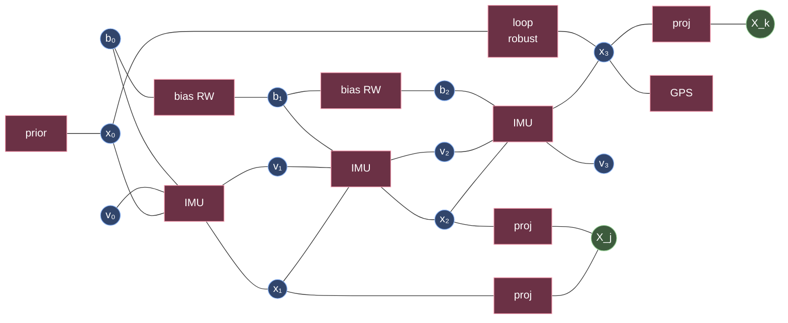

# Chapter 3 — GTSAM and Factor Graphs

!!! abstract "Implements"
    **`Backend` (§1.4).** Consumes `Factor[]` — including the `PreintegratedImu` built in Chapter 2 — and produces `NavState`/`Values`. Rate domains **C** and **D** of §1.3.


## 3.1 The formulation

A factor graph is a bipartite graph: **variable nodes** $\mathbf{X} = \{\mathbf{x}_1,\dots,\mathbf{x}_n\}$ and **factor nodes** $\{\phi_i\}$, where each factor connects the subset of variables it constrains.

$$p(\mathbf{X}\mid\mathbf{Z}) \propto \prod_i \phi_i(\mathbf{X}_i)$$

With Gaussian noise, $\phi_i(\mathbf{X}_i) = \exp\!\left(-\tfrac{1}{2}\|h_i(\mathbf{X}_i) - \mathbf{z}_i\|^2_{\boldsymbol{\Sigma}_i}\right)$, so MAP inference becomes nonlinear least squares:

$$\mathbf{X}^\star = \arg\min_\mathbf{X}\ \sum_i \left\|h_i(\mathbf{X}_i) - \mathbf{z}_i\right\|^2_{\boldsymbol{\Sigma}_i}$$

**Whitening.** Absorb $\boldsymbol{\Sigma}^{-1/2}$ (Cholesky) into the residual so every factor becomes unit-covariance and the problem is a plain $\|\cdot\|_2$ minimization. GTSAM does this internally; it is why `noiseModel::Diagonal::Sigmas` and `::Variances` are different functions and mixing them up silently mis-weights your graph by a square.

## 3.2 Linearization and solution

Linearize at $\mathbf{X}^{(k)}$, in the **tangent space**:

$$\mathbf{A}\,\delta = \mathbf{b}, \qquad \mathbf{A} = \begin{bmatrix}\boldsymbol{\Sigma}_1^{-1/2}\mathbf{J}_1\\ \vdots\end{bmatrix},\quad \mathbf{b} = \begin{bmatrix}\boldsymbol{\Sigma}_1^{-1/2}(\mathbf{z}_1 - h_1(\mathbf{X}^{(k)}))\\ \vdots\end{bmatrix}$$

Normal equations: $\mathbf{A}^\top\mathbf{A}\,\delta = \mathbf{A}^\top\mathbf{b}$, where $\boldsymbol{\Lambda} = \mathbf{A}^\top\mathbf{A}$ is the **information matrix**. Solve by sparse Cholesky ($\boldsymbol{\Lambda} = \mathbf{R}^\top\mathbf{R}$) or QR on $\mathbf{A}$ directly (better conditioned — $\kappa(\mathbf{A}^\top\mathbf{A}) = \kappa(\mathbf{A})^2$).

Then **retract** on the manifold, do not add:

$$\mathbf{X}^{(k+1)} = \mathbf{X}^{(k)} \oplus \delta \quad\text{i.e.}\quad \texttt{Values::retract(delta)}$$

Levenberg-Marquardt: $(\boldsymbol{\Lambda} + \lambda\,\mathrm{diag}(\boldsymbol{\Lambda}))\,\delta = \mathbf{A}^\top\mathbf{b}$. Dogleg trades region-trust for step-size control and is often more robust on SLAM problems.

Solvers are no longer CPU-only. NVIDIA's **[cuNLS](https://github.com/nvidia-isaac/cuNLS)** is a CUDA nonlinear least-squares library aimed at exactly these problems — bundle adjustment, pose-graph optimization, ICP-style alignment — and ships bundled inside cuVSLAM ([§4.4](chapter-4.md)). Worth knowing about before assuming Ceres/g2o/GTSAM on the CPU is the only option for the backend.

## 3.3 Sparsity, elimination, and the Bayes tree

$\boldsymbol{\Lambda}$ is sparse because each factor touches few variables. Solving = **variable elimination**, which converts the factor graph into a Bayes net (a chordal graph), and grouping its cliques gives the **Bayes tree**.

Elimination order determines **fill-in** — how many zeros become non-zeros during factorization. This is a graph-theoretic problem (minimum fill-in is NP-hard), solved heuristically with **COLAMD** or **METIS** nested dissection. On a pose graph the difference between a good and a bad ordering is easily an order of magnitude in solve time.

**Marginalization** of a variable $\mathbf{x}_m$ is the Schur complement:

$$\begin{bmatrix}\boldsymbol{\Lambda}_{mm} & \boldsymbol{\Lambda}_{mr}\\ \boldsymbol{\Lambda}_{rm} & \boldsymbol{\Lambda}_{rr}\end{bmatrix} \;\longrightarrow\; \boldsymbol{\Lambda}_{rr} - \boldsymbol{\Lambda}_{rm}\boldsymbol{\Lambda}_{mm}^{-1}\boldsymbol{\Lambda}_{mr}$$

The result is **dense over the Markov blanket** of the marginalized variable. This is the fundamental cost of fixed-lag smoothing and the reason you marginalize *keyframes*, not every frame: each marginalization permanently densifies the graph. It is also why marginalizing a landmark seen by 50 keyframes creates a 50-clique and is usually a mistake.

## 3.4 iSAM2

Three ideas, all about doing incremental work only:

1. **Incremental factorization.** New factors touch few variables. Identify the affected Bayes-tree cliques, detach that subtree into a factor graph, re-eliminate it with a locally improved ordering, reattach. Untouched parts of the tree are never revisited.
2. **Fluid relinearization.** Relinearize a variable only when its accumulated linear delta exceeds `relinearizeThreshold`. Most variables far from the current pose never move enough to justify it.
3. **Partial state update.** Back-substitute only where the delta is significant (`wildfireThreshold`), stopping propagation down branches whose change is negligible.

Net effect: constant-time updates for exploration, and cost proportional to the *affected region* for loop closures — a large loop closure genuinely does cost a lot, and that is correct.

## 3.5 Core GTSAM vocabulary

| Concept | Class |
|---|---|
| Graph container | `NonlinearFactorGraph` |
| Variable assignment | `Values` |
| Poses | `Pose2`, `Pose3`, `Rot3`, `NavState` ($SE_2(3)$) |
| IMU bias | `imuBias::ConstantBias` |
| Preintegration | `PreintegratedImuMeasurements`, `PreintegratedCombinedMeasurements` |
| IMU factors | `ImuFactor` (5 vars) , `CombinedImuFactor` (6 vars, bias evolution folded in) — built from [Chapter 2](chapter-2.md) |
| Odometry / loop | `BetweenFactor<Pose3>` |
| Anchoring | `PriorFactor<T>` |
| GNSS | `GPSFactor`, `GPSFactorArm` |
| Vision | `GenericProjectionFactor`, `SmartProjectionPoseFactor` |
| Noise | `noiseModel::{Isotropic,Diagonal,Gaussian,Robust}` |
| Robust kernels | `noiseModel::mEstimator::{Huber,Cauchy,GemanMcClure,Tukey}` |
| Optimizers | `LevenbergMarquardtOptimizer`, `DoglegOptimizer`, `ISAM2` |
| Fixed lag | `IncrementalFixedLagSmoother`, `BatchFixedLagSmoother` |
| Keys | `Symbol('x', i)` → typed, human-readable indices |

**Smart factors** deserve emphasis: `SmartProjectionPoseFactor` eliminates the landmark on the fly via Schur complement at every linearization, so the landmark never enters `Values` at all. You get the same information as full BA with a state containing only poses. The cost is that the landmark is re-triangulated each iteration, and degenerate configurations (pure rotation, tiny parallax) must be detected and the factor discarded — GTSAM exposes `SmartProjectionParams` with exactly those thresholds.

## 3.6 Pseudocode — a LIO-SAM-shaped graph

This is the canonical structure: IMU preintegration + odometry factors + GNSS + loop closures under iSAM2.

```
# --- setup ---
params = ISAM2Params(relinearizeThreshold=0.1, relinearizeSkip=1)
isam   = ISAM2(params)
graph  = NonlinearFactorGraph()
values = Values()

X = lambda i: Symbol('x', i)   # Pose3
V = lambda i: Symbol('v', i)   # Vector3 velocity
B = lambda i: Symbol('b', i)   # imuBias::ConstantBias

# --- anchor the gauge (mandatory: 4-6 DoF are otherwise free) ---
graph.add(PriorFactor_Pose3(X(0), prior_pose, prior_pose_noise))
graph.add(PriorFactor_Vector3(V(0), prior_vel,  prior_vel_noise))
graph.add(PriorFactor_Bias(B(0),    prior_bias, prior_bias_noise))
values.insert(X(0), prior_pose); values.insert(V(0), prior_vel)
values.insert(B(0), prior_bias)

pim = PreintegratedCombinedMeasurements(imu_params, prior_bias)
i = 0

# --- main loop ---
while running:
    for (w, a, dt) in imu_since_last_keyframe():
        pim.integrateMeasurement(a, w, dt)

    if not keyframe_triggered():   continue
    i += 1

    # 1. IMU factor
    graph.add(CombinedImuFactor(X(i-1), V(i-1), X(i), V(i), B(i-1), B(i), pim))

    # 2. exteroceptive odometry (scan matching / VO) as a between factor
    graph.add(BetweenFactor_Pose3(X(i-1), X(i), T_rel, odom_noise))

    # 3. absolute measurements when available
    if gnss.valid():
        graph.add(GPSFactor(X(i), gnss.enu, gnss.noise))

    # 4. loop closures  ── robust kernel is NOT optional here
    for (j, T_loop, fitness) in detect_loop_candidates(i):
        if fitness < FITNESS_TH:                       # geometric verification
            n = noiseModel_Robust(
                    mEstimator_Cauchy(0.1),
                    noiseModel_Diagonal_Variances(loop_var))
            graph.add(BetweenFactor_Pose3(X(j), X(i), T_loop, n))

    # 5. initial guess from IMU propagation (NOT identity)
    pred = pim.predict(NavState(values.at(X(i-1)), values.at(V(i-1))),
                       values.at(B(i-1)))
    values.insert(X(i), pred.pose()); values.insert(V(i), pred.velocity())
    values.insert(B(i), values.at(B(i-1)))

    # 6. incremental solve
    isam.update(graph, values)
    isam.update()                      # extra iterations after loop closure
    result = isam.calculateEstimate()

    # 7. reset for next interval
    graph.resize(0); values.clear()
    pim.resetIntegrationAndSetBias(result.at(B(i)))    # ← critical

    publish(result.at(X(i)))
```

Four failure modes this pseudocode is written to avoid:

- **No prior → rank-deficient system.** The graph has a free gauge; the optimizer will wander or fail.
- **Identity initial guess.** Gauss-Newton is local. Feeding it IMU-propagated initial values instead of identity is often the difference between converging and not.
- **Forgetting `resetIntegrationAndSetBias`.** The preintegration must be reset to the *newly optimized* bias, otherwise the next interval integrates against a stale linearization point and the bias estimate oscillates.
- **Loop closures with a Gaussian noise model.** One false positive with a tight Gaussian will fold the map. Cauchy or Geman-McClure, plus an independent geometric fitness gate, plus ideally **GNC** — graduated non-convexity anneals a convex surrogate toward the true robust cost, so you don't need a good initial guess for the robust problem to work.

## 3.7 Factor graph, drawn



Circles are **variable** nodes, rectangles are **factor** nodes; green circles are landmarks.

Read the structure: poses form a chain (IMU + odometry), landmarks create the fill-in that makes BA expensive, biases form their own random-walk chain, GPS and priors are unary, and the loop closure is the single edge that turns an open chain into a cycle — which is exactly why it both fixes drift and is dangerous when wrong.
