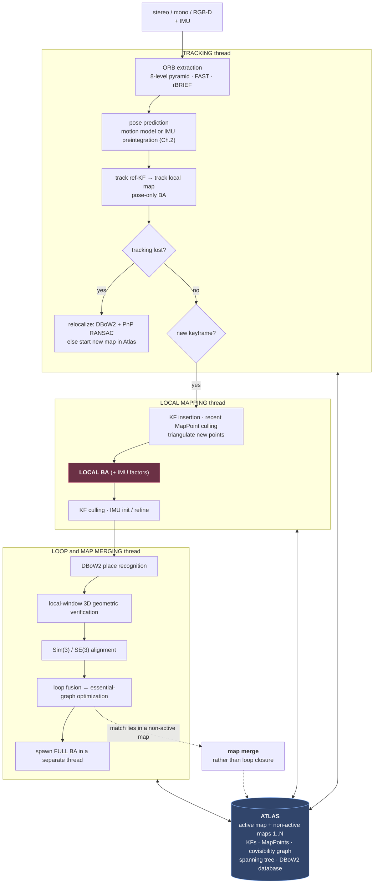
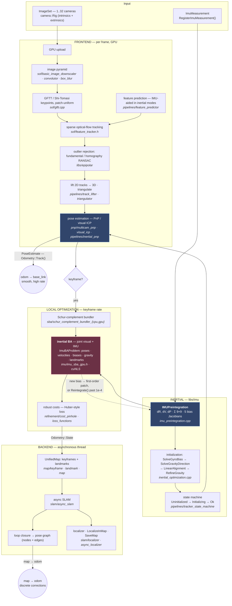

# Chapter 4 — Visual-Inertial Odometry: ORB-SLAM3 and cuVSLAM

!!! abstract "Implements"
    **`Frontend` (§1.4), and the whole B→C loop of §1.5.** Consumes `Frame` plus a `NavState` prior, produces `Feature[]`, `Landmark[]` and the projection `Factor[]` the backend consumes.


## 4.1 The measurement model

A 3D landmark $\mathbf{X}_j$ in world coordinates, observed in camera $i$:

$$\mathbf{u}_{ij} = \pi\!\left(\mathbf{T}_{CB}\,\mathbf{T}_{BW}(i)\,\mathbf{X}_j\right) + \boldsymbol{\eta}_{ij}, \qquad \boldsymbol{\eta}_{ij} \sim \mathcal{N}(\mathbf{0}, \sigma^2_{\text{px}}\mathbf{I})$$

Pinhole projection:

$$\pi\!\left([X,Y,Z]^\top\right) = \begin{bmatrix} f_x X/Z + c_x \\ f_y Y/Z + c_y\end{bmatrix}$$

Fisheye (Kannala-Brandt, which ORB-SLAM3 supports natively): $r = \sqrt{X^2+Y^2}$, $\theta = \arctan(r/Z)$, $\theta_d = \theta(1 + k_1\theta^2 + k_2\theta^4 + k_3\theta^6 + k_4\theta^8)$, then scale $[X,Y]$ by $\theta_d/r$.

Reprojection Jacobian, factored through the chain rule:

$$
\frac{\partial\mathbf{u}}{\partial\delta\boldsymbol{\xi}} = \frac{\partial\pi}{\partial\mathbf{X}_C}\cdot\frac{\partial\mathbf{X}_C}{\partial\delta\boldsymbol{\xi}}, \qquad
\frac{\partial\pi}{\partial\mathbf{X}_C} = \begin{bmatrix} f_x/Z & 0 & -f_x X/Z^2\\ 0 & f_y/Z & -f_y Y/Z^2\end{bmatrix}
$$

$$\frac{\partial\mathbf{X}_C}{\partial\delta\boldsymbol{\xi}} = \begin{bmatrix}\mathbf{I} & -\lfloor\mathbf{X}_C\rfloor_\times\end{bmatrix} \quad\text{(right perturbation, }\delta\boldsymbol{\xi}=[\delta\boldsymbol{\rho},\delta\boldsymbol{\phi}]\text{)}$$

The $-f_x X/Z^2$ terms are why depth uncertainty dominates: a landmark at large $Z$ contributes almost nothing to translation observability. This is the analytical reason stereo baselines matter and why monocular VO at long range is essentially a bearing-only problem.

## 4.2 The VI bundle adjustment objective

The joint MAP problem over a window of keyframes $\mathcal{K}$, landmarks $\mathcal{L}$:

$$\min_{\{\mathbf{R}_i,\mathbf{p}_i,\mathbf{v}_i,\mathbf{b}_i\},\{\mathbf{X}_j\}}\ \sum_{i\in\mathcal{K}}\sum_{j\in\mathcal{L}_i}\rho\!\left(\left\|\mathbf{u}_{ij} - \pi(\mathbf{T}_i,\mathbf{X}_j)\right\|^2_{\boldsymbol{\Sigma}_{ij}}\right) \;+\; \sum_{i\in\mathcal{K}}\left\|\mathbf{r}_{\mathcal{I}(i,i+1)}\right\|^2_{\boldsymbol{\Sigma}_{\mathcal{I}}} \;+\; \left\|\mathbf{r}_{\text{prior}}\right\|^2_{\boldsymbol{\Sigma}_p}$$

Three terms: visual reprojection (with a robust kernel $\rho$, typically Huber), the **IMU preintegration factors built in [Chapter 2](chapter-2.md)** — this objective is where they are finally spent — and the marginalization prior carrying the information of everything already dropped from the window. The inertial term is what fixes metric scale and the gravity direction; without it the visual half alone is the $Sim(3)$-ambiguous problem described just below.

**Gauge freedom.** Vision-only monocular is invariant under $Sim(3)$ — 7 unobservable DoF. Adding an IMU fixes scale and the gravity direction (roll and pitch), leaving **4 unobservable DoF: global position (3) and yaw (1).** Fix the gauge with a prior factor on the first keyframe, or accept a rank-deficient Hessian and use a pseudo-inverse. Practically, an unfixed gauge shows up as a Hessian with 4 near-zero eigenvalues and an LM solver that behaves oddly at small $\lambda$.

## 4.3 ORB-SLAM3 — architecture

Three concurrent threads plus the Atlas.



**The four things that make ORB-SLAM3 what it is:**

1. **MAP-based inertial initialization**, in three stages: (a) vision-only MAP to get an up-to-scale map, (b) **inertial-only MAP** which jointly estimates scale, gravity direction, velocities and biases treating the visual trajectory as fixed, (c) joint visual-inertial MAP refinement. Converges in ~2 s versus tens of seconds for the classical closed-form-plus-refinement approaches. The insight is that scale and gravity should be *estimated with their uncertainty*, not solved in closed form and then hoped about.

2. **Atlas / multi-map.** When tracking is lost, rather than trying to relocalize forever in the current map, start a new active map and keep the old one. Place recognition runs against *all* maps; a match in a non-active map triggers **map merging** rather than a loop closure. This makes the system robust to kidnapping and to genuinely disconnected sessions.

3. **Improved place recognition with local-window verification.** Classical DBoW2 requires temporal consistency across several consecutive frames before accepting a candidate, which costs recall and delays closure. ORB-SLAM3 instead checks a candidate immediately against a *local window* of its covisible keyframes and their map points, requiring geometric consistency in 3D. Higher recall, faster closure — and recall matters more than precision here only because the geometric check is strong enough to keep precision high.

4. **Covisibility graph + essential graph.** Local BA optimizes only the covisible set (bounded cost, independent of map size). Loop closure runs pose-graph optimization over the sparser essential graph (strong covisibility edges + spanning tree + loop edges) rather than full BA, then spawns full BA in a separate thread so tracking never blocks.

**Tracking pseudocode:**

```
track(frame, imu_measurements):
    ORB_extract(frame)                       # 8-level pyramid, FAST, rBRIEF

    if IMU_initialized:
        predicted_pose = preintegrate(last_state, imu_measurements)
    else:
        predicted_pose = constant_velocity_model(last_pose)

    ok = track_with_motion_model(predicted_pose)      # guided matching
    if not ok:
        ok = track_reference_keyframe()                # BoW matching
    if not ok:
        ok = relocalize()                              # DBoW2 + PnP RANSAC
        if not ok:
            if IMU_initialized and time_lost < THRESH:
                continue_on_IMU_dead_reckoning()
            else:
                atlas.create_new_map()                 # ← Atlas
                return

    track_local_map()          # project local MapPoints, match, pose-only BA
    if need_new_keyframe():    # tracked-points ratio, elapsed time,
        create_keyframe()      # IMU-driven frequency when uninitialized
```

## 4.4 cuVSLAM

NVIDIA's GPU visual-inertial system, the engine under `isaac_ros_visual_slam`, and directly relevant if the target stack is Isaac ROS + Nav2 + nvblox on Jetson.

!!! info "Now publicly released"
    cuVSLAM is published at **[github.com/nvidia-isaac/cuVSLAM](https://github.com/nvidia-isaac/cuVSLAM)** under the **NVIDIA Community License**. Read the licence before assuming "open source" in the OSI sense — the core is distributed as a prebuilt `libcuvslam.so`, with the C++ and Python bindings, examples and build tooling in the repo. That is a materially different proposition from the GPLv3 of ORB-SLAM3, and it is the kind of distinction that decides what ships in a commercial robot.

**Supported configurations**, per the repository:

| Mode | Configuration |
|---|---|
| Monocular | 1 camera — scale-ambiguous |
| RGB-D | 1 RGB-D camera with aligned depth |
| Multicamera | ≥2 cameras with an overlapping pair, **up to 32 cameras total** |
| Inertial | stereo pair + 1 IMU |
| Multisensor | ≥1 RGB-D or overlapping pair, optional IMU (experimental) |

Platforms are Ubuntu 22.04/24.04 on x86_64 and aarch64, **Jetson Orin** (JetPack 6.x, CUDA 12) and **Jetson Thor** (JetPack 7.x, CUDA 13). APIs are C++ and Python — **PyCuVSLAM** ships prebuilt wheels for Python 3.10+, which makes it far easier to benchmark against ORB-SLAM3 or OpenVINS than it used to be.

The release also exposes **[cuNLS](https://github.com/nvidia-isaac/cuNLS)**, NVIDIA's CUDA-accelerated nonlinear least-squares solver, built from source via `FetchContent` and bundled into `libcuvslam` (`USE_CUNLS=ON` by default). It targets exactly the workloads of [Chapter 3](chapter-3.md) — bundle adjustment, pose-graph optimization, ICP-style alignment — which makes it the first credible GPU alternative to Ceres/g2o/GTSAM for the backend, not just the frontend. If you have been assuming the GPU only helps with feature extraction, that assumption is now out of date.

Architecture, per the cuVSLAM paper: two major blocks, **frontend** and **backend**. The frontend handles real-time low-latency pose estimation and local mapping, prioritizing trajectory smoothness, and maintains a local odometry map of recent keyframe poses, visible 3D landmarks and their observations. It splits into a **2D module** — keypoint selection, feature tracking, keyframe selection — and a **3D module**. Keypoint selection divides the image into patches and takes Shi-Tomasi "Good Features to Track" per patch, enforcing approximately uniform spatial distribution with a total count above a threshold. The **backend** runs asynchronously and handles global map consistency via pose-graph optimization and loop closure, over a global map of camera poses, 2D observations, 3D landmarks, pose deltas and visual features.

Isaac ROS documents that all SLAM-related operations run in a separate thread in parallel with visual odometry, that images are copied to GPU before tracking begins, and that landmarks and the pose graph are stored in a structure that does not grow when the same landmark is revisited.



The per-frame settings struct decomposes along exactly these stages — `TrackPerFrameSettings` has `sof`, `kf`, `pnp` and `icp` sub-structs, one per box in the frontend row.

| Module | Role |
|---|---|
| `libs/sof` | sparse optical flow: pyramid, GFTT/Shi-Tomasi, feature tracking |
| `libs/epipolar` | fundamental matrix, homography, RANSAC, resectioning, reconstruction |
| `libs/pnp` | mono / multicam PnP, visual ICP, multisensor pose estimator |
| `libs/odometry` | per-mode odometry: mono, multi, RGB-D, stereo-inertial, multisensor; ground constraint |
| `libs/imu` | preintegration, inertial SBA (CPU + GPU), gravity/bias initialization, gyro-bias NEC |
| `libs/sba` | Schur-complement bundler, CPU and GPU |
| `libs/refinement` | cost functions (pinhole, rational polynomial) and robust loss functions |
| `libs/map` | keyframes, landmarks, depth-point and plane maps |
| `libs/slam` | async SLAM, loop closure, localizer, map view |
| `libs/pipelines` | orchestration — `track_online_{mono,multi,rgbd,inertial,multisensor}`, state machine, async SBA service |

**Reported performance:** average trajectory error below 1% on KITTI odometry and mean position error under 5 cm on EuRoC, running in real time on Jetson. Deployed processing 8 Full-HD distorted RGB images at 30 FPS from 4 stereo cameras on a Jetson Orin AGX within the Isaac Perceptor framework. Multi-camera mode gives two documented benefits: trajectory reliability in feature-poor environments, and higher loop-closure detection rates. A demonstrated robustness test covered cameras randomly with opaque film for 20–60 s intervals with at least one stereo pair uncovered, and tracking survived.

### The public API is the §1.1 split, shipping

Two classes, and they are exactly the frontend/backend division of [Chapter 1](chapter-1.md) — which is the strongest evidence that split is not just a pedagogical device:

```cpp
class Odometry {                     // frontend — Ch.1 domains A–C
  PoseEstimate Track(const ImageSet& images,
                     const ImageSet& masks = {},
                     const ImageSet& depths = {});
  void RegisterImuMeasurement(uint32_t sensor_index, const ImuMeasurement&);
  void GetState(State& state) const;
};

class Slam {                         // backend — Ch.1 domain D
  void Track(const Odometry::State& state, const Pose* gt_pose = nullptr);
  Pose GetPose() const;
  void SaveMap(folder, callback);
  void LocalizeInMap(folder, timestamp_ns, guess_pose, ...);
  void GetLoopClosurePoses(std::vector<PoseStamped>&);
};
```

`Slam::Track()` takes an `Odometry::State`, so **that struct is the wire** between the two — the concrete instance of §1.2's contract:

| `Odometry::State` field | Corresponds to |
|---|---|
| `Pose delta` — change since last keyframe | the *relative* odometry constraint, never a global pose |
| `bool keyframe` | the keyframe-selector decision, i.e. the domain B → C boundary of §1.3 |
| `std::optional<Gravity> gravity` | present only in `Inertial`/`Multisensor` with an IMU — the gravity direction that §4.2 says inertial data makes observable |
| `std::vector<Observation> observations` | `Feature` |
| `std::vector<Landmark> landmarks` | `Landmark` |
| `ContextMap context` | opaque, backend-internal |

Two details reward attention. `Slam` exposes its `PoseGraph` as explicit `nodes` and `edges` — the pose-graph optimization of [Chapter 3](chapter-3.md), not hidden behind an opaque handle. And v17.0.0 *"split `Slam::Track()` into a void tracking call and `Slam::GetPose()`"*: the backend no longer makes the caller wait for a pose, which is precisely the domain-D-must-not-block rule of §1.3, learned the same way everyone learns it.

Version 17.0.0 (2026-07-21) enables cuNLS by default and adds the `Multisensor` mode — any mix of RGB and RGB-D cameras with an optional IMU, which requires a `-DUSE_CUNLS=ON` build and currently supports pinhole cameras only.

**Practical guidance from the NVIDIA docs that matters for a real rig:** synchronization significantly affects performance and should ideally be hardware-based with verified relative timestamps across cameras; VGA or higher resolution is recommended; 30 FPS suits typical human-speed motion; and image quality — lenses, exposure, white balance — matters because clipped regions destroy features.

That last cluster is your hardware-integration territory. The XVS master/slave sync on global-shutter sensors and FC-triggered capture is exactly what "ideally through hardware synchronization" means, and being able to say *why* — that a 10 ms inter-camera skew at 1 m/s injects a 1 cm baseline error that the triangulation attributes to depth — is a much stronger statement than "I set up the cameras."

## 4.5 Contrast: MSCKF, the filter-based alternative

Worth knowing because OpenVINS and many commercial VIOs use it, and because the null-space trick is elegant.

State = IMU state + a **sliding window of past camera poses**. Landmarks are *not* in the state. For a feature observed in $M$ poses, stack the residuals:

$$\mathbf{r} = \mathbf{H}_x\,\delta\mathbf{x} + \mathbf{H}_f\,\delta\mathbf{X}_f + \mathbf{n}$$

Let $\mathbf{N}$ be a basis for the **left null space** of $\mathbf{H}_f$ (i.e. $\mathbf{N}^\top\mathbf{H}_f = \mathbf{0}$). Project:

$$\mathbf{N}^\top\mathbf{r} = \mathbf{N}^\top\mathbf{H}_x\,\delta\mathbf{x} + \mathbf{N}^\top\mathbf{n}$$

The landmark is gone. You get a landmark-free EKF update whose cost is linear in window size rather than quadratic in landmark count. The price is that the landmark is marginalized *by projection*, so its information is used once and discarded — no map is built, hence no loop closure.

**Consistency.** Naive MSCKF gains spurious information along the 4 unobservable directions, because the same state is linearized at different points across timesteps, artificially raising the rank of the observability matrix. Fixes: **FEJ** (fix each state's linearization point at its first estimate) or **OC-EKF** (project Jacobians onto the correct nullspace). The consequence of not fixing it is an overconfident covariance — which is worse than an inaccurate one, because everything downstream trusts it.

## 4.6 Comparison

| | ORB-SLAM3 | cuVSLAM | VINS-Fusion | OpenVINS |
|---|---|---|---|---|
| Backend | Local BA + pose graph + full BA | Local opt + pose graph (async) | Fixed-lag smoother (Ceres) | MSCKF filter |
| Features | ORB (binary) | Shi-Tomasi + tracking, GPU | Shi-Tomasi + KLT | KLT / descriptor |
| Landmarks in state | Yes (map) | Yes (map) | Yes (window) | No (null-space) |
| Loop closure | DBoW2 + local-window 3D verification | Yes, pose graph | DBoW2 | Not core |
| Multi-map | Yes (Atlas) | Map save/load | No | No |
| Hardware | CPU, multi-thread | **GPU / Jetson** (Orin, Thor) | CPU | CPU |
| Licence | GPLv3 | **NVIDIA Community License** (prebuilt core + open bindings) | GPLv3 | GPLv3 |

The GPLv3 column is not a footnote — it is often the actual decision driver in a commercial robot, and mentioning it signals you've shipped something rather than only benchmarked.
