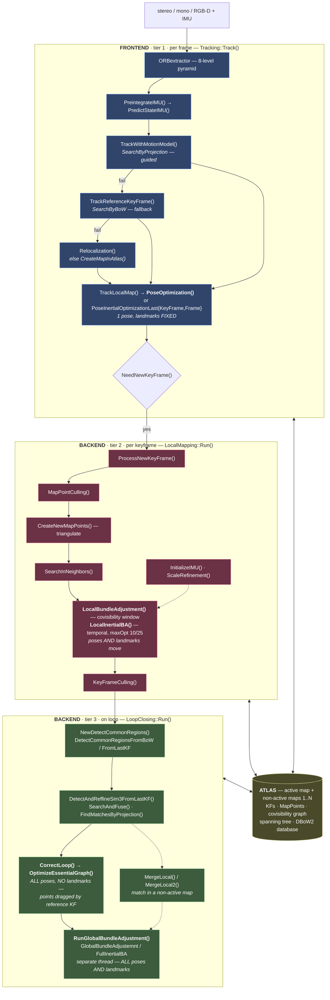
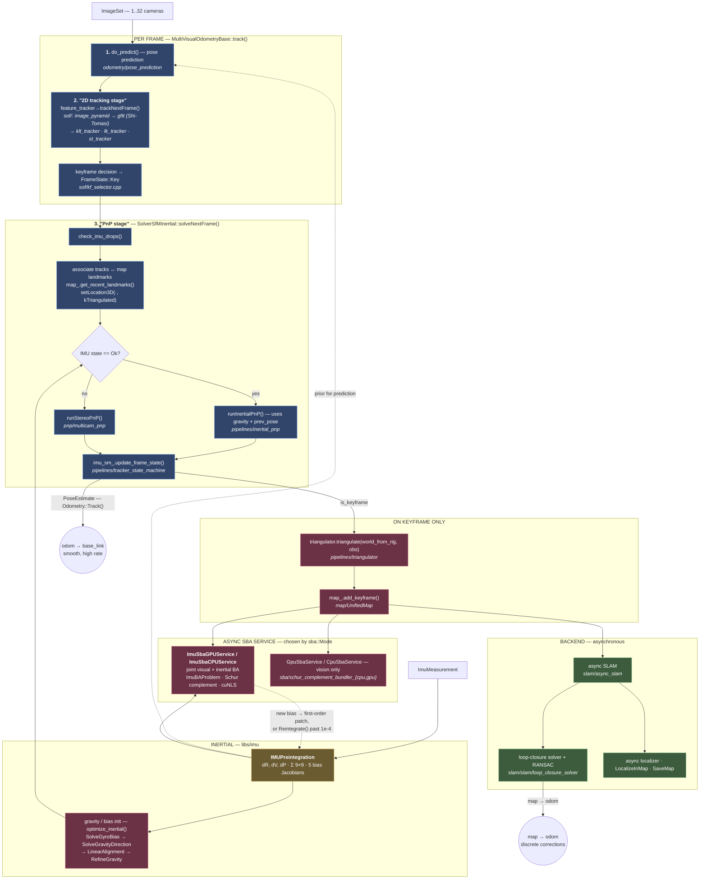
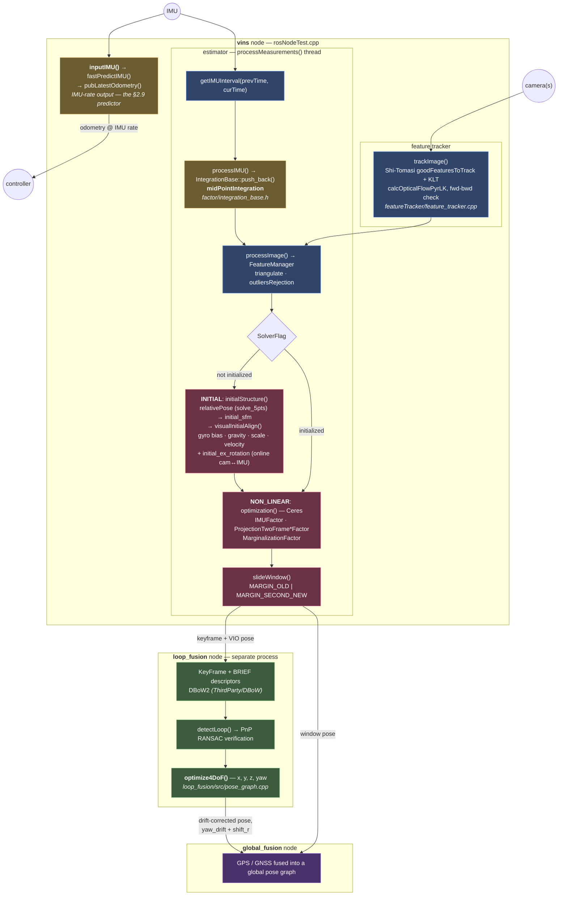

# Chapter 4 — Visual-Inertial Odometry: ORB-SLAM3 and cuVSLAM

!!! abstract "Implements"
    **`Frontend` (§1.5), and the whole B→C loop of §1.6.** Consumes `Frame` plus a `NavState` prior, produces `Feature[]`, `Landmark[]` and the projection `Factor[]` the backend consumes.


## 4.1 The measurement model

A 3D landmark $\mathbf{X}_j$ in world coordinates, observed in camera $i$:

$$\mathbf{u}_{ij} = \pi\!\left(\mathbf{T}_{CB}\,\mathbf{T}_{BW}(i)\,\mathbf{X}_j\right) + \boldsymbol{\eta}_{ij}, \qquad \boldsymbol{\eta}_{ij} \sim \mathcal{N}(\mathbf{0}, \sigma^2_{\text{px}}\mathbf{I})$$

Pinhole projection:

$$\pi\!\left([X,Y,Z]^\top\right) = \begin{bmatrix} f_x X/Z + c_x \\ f_y Y/Z + c_y\end{bmatrix}$$

Fisheye (Kannala-Brandt, which ORB-SLAM3 supports natively): $r = \sqrt{X^2+Y^2}$, $\theta = \arctan(r/Z)$, $\theta_d = \theta(1 + k_1\theta^2 + k_2\theta^4 + k_3\theta^6 + k_4\theta^8)$, then scale $[X,Y]$ by $\theta_d/r$.

Reprojection Jacobian, factored through the chain rule:

$$
\frac{\partial\mathbf{u}}{\partial\delta\boldsymbol{\xi}} = \frac{\partial\pi}{\partial\mathbf{X}_C}\cdot\frac{\partial\mathbf{X}_C}{\partial\delta\boldsymbol{\xi}}, \qquad
\frac{\partial\pi}{\partial\mathbf{X}_C} = \begin{bmatrix} f_x/Z & 0 & -f_x X/Z^2\\ 0 & f_y/Z & -f_y Y/Z^2\end{bmatrix}
$$

$$\frac{\partial\mathbf{X}_C}{\partial\delta\boldsymbol{\xi}} = \begin{bmatrix}\mathbf{I} & -\lfloor\mathbf{X}_C\rfloor_\times\end{bmatrix} \quad\text{(right perturbation, }\delta\boldsymbol{\xi}=[\delta\boldsymbol{\rho},\delta\boldsymbol{\phi}]\text{)}$$

The $-f_x X/Z^2$ terms are why depth uncertainty dominates: a landmark at large $Z$ contributes almost nothing to translation observability. This is the analytical reason stereo baselines matter and why monocular VO at long range is essentially a bearing-only problem.

## 4.2 The VI bundle adjustment objective

The joint MAP problem over a window of keyframes $\mathcal{K}$, landmarks $\mathcal{L}$:

$$\min_{\{\mathbf{R}_i,\mathbf{p}_i,\mathbf{v}_i,\mathbf{b}_i\},\{\mathbf{X}_j\}}\ \sum_{i\in\mathcal{K}}\sum_{j\in\mathcal{L}_i}\rho\!\left(\left\|\mathbf{u}_{ij} - \pi(\mathbf{T}_i,\mathbf{X}_j)\right\|^2_{\boldsymbol{\Sigma}_{ij}}\right) \;+\; \sum_{i\in\mathcal{K}}\left\|\mathbf{r}_{\mathcal{I}(i,i+1)}\right\|^2_{\boldsymbol{\Sigma}_{\mathcal{I}}} \;+\; \left\|\mathbf{r}_{\text{prior}}\right\|^2_{\boldsymbol{\Sigma}_p}$$

Three terms: visual reprojection (with a robust kernel $\rho$, typically Huber), the **IMU preintegration factors built in [Chapter 2](chapter-2.md)** — this objective is where they are finally spent — and the marginalization prior carrying the information of everything already dropped from the window. The inertial term is what fixes metric scale and the gravity direction; without it the visual half alone is the $Sim(3)$-ambiguous problem described just below.

**Gauge freedom.** Vision-only monocular is invariant under $Sim(3)$ — 7 unobservable DoF. Adding an IMU fixes scale and the gravity direction (roll and pitch), leaving **4 unobservable DoF: global position (3) and yaw (1).** Fix the gauge with a prior factor on the first keyframe, or accept a rank-deficient Hessian and use a pseudo-inverse. Practically, an unfixed gauge shows up as a Hessian with 4 near-zero eigenvalues and an LM solver that behaves oddly at small $\lambda$.

## 4.3 ORB-SLAM3 — architecture

Three concurrent threads plus the Atlas.



Colours are the tiers of [§1.1](chapter-1.md): **blue** = per frame, landmarks fixed; **red** = per keyframe, landmarks move; **green** = on loop, whole map. The three subgraphs are ORB-SLAM3's three threads, which map onto frontend (Tracking) and backend (LocalMapping, LoopClosing).

!!! note "What actually moves, at each tier"
    | | Poses | Landmarks |
    |---|---|---|
    | `PoseOptimization()` | 1 — current frame | **fixed**, used as measurements |
    | `LocalBundleAdjustment()` / `LocalInertialBA()` | window | **free variables** — each moves independently to fit *all* the keyframes that observe it |
    | `OptimizeEssentialGraph()` | **all** | **not variables at all** — afterwards each point is *rigidly dragged* by its reference keyframe |
    | `RunGlobalBundleAdjustment()` | **all** | **free variables** again |

    The pose-graph row is the subtle one, and the code states it plainly:

    ```cpp
    KeyFrame* pRefKF = pMP->GetReferenceKeyFrame();
    g2o::Sim3 Srw         = vScw[nIDr];           // reference KF, before
    g2o::Sim3 correctedSwr = vCorrectedSwc[nIDr]; // reference KF, after
    eigCorrectedP3Dw = correctedSwr.map(Srw.map(eigP3Dw));
    pMP->SetWorldPos(eigCorrectedP3Dw.cast<float>());
    ```

    A point is pushed into its reference keyframe's *old* frame and pulled back out through the *corrected* one. It moves rigidly with that one keyframe, so the map does not tear apart — but its geometry is never re-fitted. That is precisely the information the pose graph discarded, and precisely what the full BA afterwards exists to restore.

**The four things that make ORB-SLAM3 what it is:**

1. **MAP-based inertial initialization**, in three stages: (a) vision-only MAP to get an up-to-scale map, (b) **inertial-only MAP** which jointly estimates scale, gravity direction, velocities and biases treating the visual trajectory as fixed, (c) joint visual-inertial MAP refinement. In the source these are three overloads of one function — `InertialOptimization(pMap, Rwg, scale, bg, ba, bMono, covInertial, …)` for the full inertial-only stage, then `(pMap, bg, ba)` and `(pMap, Rwg, scale)` for the cheaper refinements — and the full one returns `covInertial`, so the initialization reports its own uncertainty rather than a point estimate. Converges in ~2 s versus tens of seconds for the classical closed-form-plus-refinement approaches. The insight is that scale and gravity should be *estimated with their uncertainty*, not solved in closed form and then hoped about.

2. **Atlas / multi-map.** When tracking is lost, rather than trying to relocalize forever in the current map, start a new active map and keep the old one. Place recognition runs against *all* maps; a match in a non-active map triggers **map merging** rather than a loop closure. This makes the system robust to kidnapping and to genuinely disconnected sessions.

3. **Improved place recognition with local-window verification.** Classical DBoW2 requires temporal consistency across several consecutive frames before accepting a candidate, which costs recall and delays closure. ORB-SLAM3 instead checks a candidate immediately against a *local window* of its covisible keyframes and their map points, requiring geometric consistency in 3D. Higher recall, faster closure — and recall matters more than precision here only because the geometric check is strong enough to keep precision high.

4. **Covisibility graph + essential graph.** Local BA optimizes only the covisible set (bounded cost, independent of map size). Loop closure runs pose-graph optimization over the sparser essential graph (strong covisibility edges + spanning tree + loop edges) rather than full BA, then spawns full BA in a separate thread so tracking never blocks.

**Tracking pseudocode:**

```
track(frame, imu_measurements):
    ORB_extract(frame)                       # 8-level pyramid, FAST, rBRIEF

    if IMU_initialized:
        predicted_pose = preintegrate(last_state, imu_measurements)
    else:
        predicted_pose = constant_velocity_model(last_pose)

    ok = track_with_motion_model(predicted_pose)      # guided matching
    if not ok:
        ok = track_reference_keyframe()                # BoW matching
    if not ok:
        ok = relocalize()                              # DBoW2 + PnP RANSAC
        if not ok:
            if IMU_initialized and time_lost < THRESH:
                continue_on_IMU_dead_reckoning()
            else:
                atlas.create_new_map()                 # ← Atlas
                return

    track_local_map()          # project local MapPoints, match, pose-only BA
    if need_new_keyframe():    # tracked-points ratio, elapsed time,
        create_keyframe()      # IMU-driven frequency when uninitialized
```

## 4.4 cuVSLAM

NVIDIA's GPU visual-inertial system, the engine under `isaac_ros_visual_slam`, and directly relevant if the target stack is Isaac ROS + Nav2 + nvblox on Jetson.

!!! info "Open source since 2026"
    cuVSLAM is **fully open source** at **[github.com/nvidia-isaac/cuVSLAM](https://github.com/nvidia-isaac/cuVSLAM)** — 252 `.cpp`/`.cu` and 259 header files, no binary blob. Everything below is traced from that source.

    The licence is the **NVIDIA Community License**, and its restriction is *platform*, not source: the works are licensed for use **on NVIDIA platforms**. Commercial use, modification and redistribution are permitted on that hardware. So the contrast with ORB-SLAM3 is not open-vs-closed — both are readable and modifiable — it is copyleft-on-any-hardware (GPLv3) versus permissive-on-NVIDIA-hardware. Prebuilt wheels and packages are published as a *convenience*, not as the only form of distribution.

**Supported configurations**, per the repository:

| Mode | Configuration |
|---|---|
| Monocular | 1 camera — scale-ambiguous |
| RGB-D | 1 RGB-D camera with aligned depth |
| Multicamera | ≥2 cameras with an overlapping pair, **up to 32 cameras total** |
| Inertial | stereo pair + 1 IMU |
| Multisensor | ≥1 RGB-D or overlapping pair, optional IMU (experimental) |

Platforms are Ubuntu 22.04/24.04 on x86_64 and aarch64, **Jetson Orin** (JetPack 6.x, CUDA 12) and **Jetson Thor** (JetPack 7.x, CUDA 13). APIs are C++ and Python — **PyCuVSLAM** ships prebuilt wheels for Python 3.10+, which makes it far easier to benchmark against ORB-SLAM3 or OpenVINS than it used to be.

The release also exposes **[cuNLS](https://github.com/nvidia-isaac/cuNLS)**, NVIDIA's CUDA-accelerated nonlinear least-squares solver, built from source via `FetchContent` and bundled into `libcuvslam` (`USE_CUNLS=ON` by default). It targets exactly the workloads of [Chapter 3](chapter-3.md) — bundle adjustment, pose-graph optimization, ICP-style alignment — which makes it the first credible GPU alternative to Ceres/g2o/GTSAM for the backend, not just the frontend. If you have been assuming the GPU only helps with feature extraction, that assumption is now out of date.



!!! note "Traced from source"
    Read from `MultiVisualOdometryBase::track()` and `SolverSfMInertial::solveNextFrame()`, not from the paper. The stage names are the code's own: its failure paths log *"Failed to track on the 2D tracking stage"* and *"Failed to track on the PnP stage"*.

    **What v17.0.0 changed.** The skeleton holds, but the inertial path was refactored out of the solver into a dedicated **`ImuFusionContext`** (`libs/pipelines/imu_fusion_context.h`), which now owns `add_measurement()`, `solve_inertial()` / `solve_visual()` as explicit alternatives, and `finalize_frame() → FrameResult{valid_pose, lost}` — so "PnP succeeded", "IMU carried the frame" and "both failed" became distinct outcomes rather than a boolean. Also new: `track_lifter` (the keyframe step is now a single `triangulate_and_lift` trace event), `depth_maps_context` for RGB-D and multisensor rigs, `track_online_multisensor` for the mixed RGB/RGB-D + optional IMU mode, and `gyro_bias_nec` — a bearing-vector gyro-bias estimator used when there are too few keyframes, or the motion is static or pure rotation and the linear method degenerates. cuNLS is enabled by default.

Three details are worth pulling out, because each contradicts the obvious guess:

- **Triangulation happens *after* PnP, and only on keyframes.** Per frame, 3D points are not created — they are *fetched*: `map_.get_recent_landmarks()` marks tracks `kTriangulated`, and PnP resects against those. Only once a frame is accepted as a keyframe does `triangulator.triangulate()` create new landmarks. Frame-rate work stays resection-only.
- **RANSAC is not in the per-frame path.** In this tree the RANSAC implementations live under `slam/slam/loop_closure_solver` and `slam/async_localizer` — loop closure and relocalization, where a false match is catastrophic. Per-frame outlier handling is carried by the tracker and the robust costs in the bundler instead.
- **The gauge is fixed through the information matrix, not a prior factor.** On the first run, `prev_pose.info` is set to a diagonal with $10^6$ on the first six entries, commented *"first pose is fixed, but velocities and biases are free"* — the anchoring of §4.2, done by weighting rather than by adding a factor.

| Module | Role |
|---|---|
| `libs/sof` | sparse optical flow: image pyramids, `gftt` (Shi-Tomasi), KLT/LK/ST trackers, `kf_selector` |
| `libs/odometry` | per-mode odometry — mono, multi, RGB-D, stereo-inertial, multisensor; pose prediction; ground constraint |
| `libs/pnp` | mono / multicam PnP, visual ICP, multisensor pose estimator |
| `libs/imu` | preintegration, inertial SBA (CPU + GPU), gravity/bias initialization, `gyro_bias_nec` fallback |
| `libs/sba` | Schur-complement bundler, CPU and GPU |
| `libs/refinement` | cost functions (pinhole, rational polynomial) and robust losses |
| `libs/epipolar` | fundamental matrix, homography, triangulation, resectioning utilities |
| `libs/map` | `UnifiedMap`: keyframes, landmarks, depth-point and plane maps |
| `libs/slam` | async SLAM, loop-closure solvers (with RANSAC), localizer |
| `libs/pipelines` | orchestration — `track_online_{mono,multi,rgbd,inertial,multisensor}`, `ImuFusionContext`, `track_lifter`, `depth_maps_context`, state machine, async SBA service |

The per-frame settings struct decomposes along exactly these stages — `TrackPerFrameSettings` has `sof`, `kf`, `pnp` and `icp` sub-structs, one per box in the frontend row.

**Reported performance:** average trajectory error below 1% on KITTI odometry and mean position error under 5 cm on EuRoC, running in real time on Jetson. Deployed processing 8 Full-HD distorted RGB images at 30 FPS from 4 stereo cameras on a Jetson Orin AGX within the Isaac Perceptor framework. Multi-camera mode gives two documented benefits: trajectory reliability in feature-poor environments, and higher loop-closure detection rates. A demonstrated robustness test covered cameras randomly with opaque film for 20–60 s intervals with at least one stereo pair uncovered, and tracking survived.

### The public API is the §1.2 split, shipping

Two classes, and they are exactly the frontend/backend division of [Chapter 1](chapter-1.md) — which is the strongest evidence that split is not just a pedagogical device:

```cpp
class Odometry {                     // frontend — Ch.1 domains A–C
  PoseEstimate Track(const ImageSet& images,
                     const ImageSet& masks = {},
                     const ImageSet& depths = {});
  void RegisterImuMeasurement(uint32_t sensor_index, const ImuMeasurement&);
  void GetState(State& state) const;
};

class Slam {                         // backend — Ch.1 domain D
  void Track(const Odometry::State& state, const Pose* gt_pose = nullptr);
  Pose GetPose() const;
  void SaveMap(folder, callback);
  void LocalizeInMap(folder, timestamp_ns, guess_pose, ...);
  void GetLoopClosurePoses(std::vector<PoseStamped>&);
};
```

`Slam::Track()` takes an `Odometry::State`, so **that struct is the wire** between the two — the concrete instance of §1.3's contract:

| `Odometry::State` field | Corresponds to |
|---|---|
| `Pose delta` — change since last keyframe | the *relative* odometry constraint, never a global pose |
| `bool keyframe` | the keyframe-selector decision, i.e. the domain B → C boundary of §1.4 |
| `std::optional<Gravity> gravity` | present only in `Inertial`/`Multisensor` with an IMU — the gravity direction that §4.2 says inertial data makes observable |
| `std::vector<Observation> observations` | `Feature` |
| `std::vector<Landmark> landmarks` | `Landmark` |
| `ContextMap context` | opaque, backend-internal |

Two details reward attention. `Slam` exposes its `PoseGraph` as explicit `nodes` and `edges` — the pose-graph optimization of [Chapter 3](chapter-3.md), not hidden behind an opaque handle. And v17.0.0 *"split `Slam::Track()` into a void tracking call and `Slam::GetPose()`"*: the backend no longer makes the caller wait for a pose, which is precisely the domain-D-must-not-block rule of §1.4, learned the same way everyone learns it.

Version 17.0.0 (2026-07-21) enables cuNLS by default and adds the `Multisensor` mode — any mix of RGB and RGB-D cameras with an optional IMU, which requires a `-DUSE_CUNLS=ON` build and currently supports pinhole cameras only.

**Practical guidance from the NVIDIA docs that matters for a real rig:** synchronization significantly affects performance and should ideally be hardware-based with verified relative timestamps across cameras; VGA or higher resolution is recommended; 30 FPS suits typical human-speed motion; and image quality — lenses, exposure, white balance — matters because clipped regions destroy features.

That last cluster is your hardware-integration territory. The XVS master/slave sync on global-shutter sensors and FC-triggered capture is exactly what "ideally through hardware synchronization" means, and being able to say *why* — that a 10 ms inter-camera skew at 1 m/s injects a 1 cm baseline error that the triangulation attributes to depth — is a much stronger statement than "I set up the cameras."

## 4.5 VINS-Fusion — architecture

Traced from `vins/src/{featureTracker,estimator,factor,initial}` and `loop_fusion/src`. Structurally it is the odd one out: **three separate ROS nodes**, not three threads in one process, and the split is where the interesting design decisions sit.



**Four decisions that distinguish it.**

1. **Loop closure is a different process.** ORB-SLAM3 runs it as a thread sharing the Atlas; cuVSLAM as an async service sharing the map. VINS ships `loop_fusion` as its own node, communicating over topics. The estimator therefore cannot be blocked by loop closure at all — the strongest possible form of the domain-D rule in [§1.4](chapter-1.md) — at the cost of duplicating keyframe state across a process boundary.

2. **`fastPredictIMU()` on every IMU sample.** `inputIMU()` calls it and immediately publishes `pubLatestOdometry()`. This is the output predictor of [§2.9](chapter-2.md) as a first-class citizen, which is why VINS is the one of the three you can hand directly to a flight controller. Neither of the others publishes at IMU rate.

3. **Two marginalization modes.** `MARGIN_OLD` drops the oldest keyframe and folds it into the prior; `MARGIN_SECOND_NEW` throws away the second-newest *frame* instead, keeping the window's time span when the newest frame carries little parallax. That choice is made per frame from the tracked-feature parallax — the fixed-lag machinery of [§3.3](chapter-3.md) with a heuristic on top.

4. **Online extrinsic calibration.** `initial_ex_rotation` estimates the camera↔IMU rotation during initialization. The others require it from a calibration file. If your rig's extrinsics are uncertain — a compliant mount, a field-swapped camera — this alone can decide the choice.

**Initialization is loosely coupled**, unlike ORB-SLAM3's MAP formulation: a pure-visual SfM (`relativePose` via the 5-point algorithm, then `initial_sfm`) is solved first, and `visualInitialAlign()` then aligns inertial quantities to that fixed visual trajectory — solving gyro bias, gravity direction, metric scale and per-frame velocities as a linear problem. cuVSLAM's `SolveGyroBias`/`LinearAlignment` follows the same recipe and says so in its comments; ORB-SLAM3 is the one that replaced it with a MAP estimate carrying covariance.

## 4.6 Contrast: MSCKF, the filter-based alternative

Worth knowing because OpenVINS and many commercial VIOs use it, and because the null-space trick is elegant.

State = IMU state + a **sliding window of past camera poses**. Landmarks are *not* in the state. For a feature observed in $M$ poses, stack the residuals:

$$\mathbf{r} = \mathbf{H}_x\,\delta\mathbf{x} + \mathbf{H}_f\,\delta\mathbf{X}_f + \mathbf{n}$$

Let $\mathbf{N}$ be a basis for the **left null space** of $\mathbf{H}_f$ (i.e. $\mathbf{N}^\top\mathbf{H}_f = \mathbf{0}$). Project:

$$\mathbf{N}^\top\mathbf{r} = \mathbf{N}^\top\mathbf{H}_x\,\delta\mathbf{x} + \mathbf{N}^\top\mathbf{n}$$

The landmark is gone. You get a landmark-free EKF update whose cost is linear in window size rather than quadratic in landmark count. The price is that the landmark is marginalized *by projection*, so its information is used once and discarded — no map is built, hence no loop closure.

**Consistency.** Naive MSCKF gains spurious information along the 4 unobservable directions, because the same state is linearized at different points across timesteps, artificially raising the rank of the observability matrix. Fixes: **FEJ** (fix each state's linearization point at its first estimate) or **OC-EKF** (project Jacobians onto the correct nullspace). The consequence of not fixing it is an overconfident covariance — which is worse than an inaccurate one, because everything downstream trusts it.

## 4.7 Comparison

One table, traced from the three source trees rather than the three papers: ORB-SLAM3 (`src/ImuTypes.cc`, `Tracking.cc`, `LocalMapping.cc`, `LoopClosing.cc`, `include/Optimizer.h`), cuVSLAM v17.0.0 (`libs/{imu,pipelines,sof,sba,slam}`), VINS-Fusion (`vins/src/{factor,estimator,initial}`, `loop_fusion/src`).

| | **ORB-SLAM3** | **cuVSLAM** | **VINS-Fusion** |
|---|---|---|---|
| Process model | 3 threads + Atlas, one process | frontend + async SBA service + async SLAM | **3 ROS nodes**, separate processes |
| Preintegration class | `IMU::Preintegrated` | `sba_imu::IMUPreintegration` | `IntegrationBase` |
| Integration scheme | **Euler** — `dP`/`dV` use the not-yet-updated `dR` | **Euler** — identical | **Midpoint** — `midPointIntegration()` |
| Rotation storage | `Matrix3f dR` + `NormalizeRotation()` | `Matrix3T dR` + `CalculateRotationFromSVD()` | `Quaterniond delta_q` |
| Precision | `float` | `float` | `double` |
| Bias Jacobians | `JRg, JVg, JVa, JPg, JPa` | *same five names* | blocks of a 15×15 `jacobian` |
| Covariance | `Matrix<float,15,15> C` | `Matrix9T` + separate 3×3 random-walk blocks | `Matrix<double,15,15> covariance` |
| Re-integration | `Reintegrate()` | `Reintegrate()` past `reintegration_thresh = 1e-4` | `repropagate(ba, bg)` |
| Frontend | ORB, 8-level pyramid (`ORBextractor`) | GFTT/Shi-Tomasi + KLT/LK/ST on GPU (`libs/sof`) | Shi-Tomasi + KLT (`feature_tracker`) |
| Per-frame 3D work | project local map, pose-only BA | **resection only** — landmarks fetched from map, triangulation deferred to keyframes | triangulate in `FeatureManager` |
| Tracking-time optimizer | `PoseOptimization`, `PoseInertialOptimizationLast{KeyFrame,Frame}` — g2o, landmarks fixed | `runStereoPnP` / `runInertialPnP` (v17: `solve_visual()` / `solve_inertial()`) — resection, landmarks fixed | **none** — `initFramePoseByPnP()` only *seeds* the window solve |
| Local optimization | g2o `LocalBundleAdjustment` / `LocalInertialBA` (`bLarge` flag) — separate thread, **per keyframe** | async SBA *service*, `ImuBAProblem` — **per keyframe** | Ceres `optimization()` — one window BA **per frame**, same thread |
| Marginalization | `Optimizer::Marginalize(H, start, end)` | inside the bundler | `marginalization_factor`, **`MARGIN_OLD` / `MARGIN_SECOND_NEW`** |
| Gauge fixing | fixed keyframes in g2o | `prev_pose.info` = 1e6 on first 6 entries | marginalization prior |
| Global refinement | `GlobalBundleAdjustemnt`, `FullInertialBA` (`priorG=1e2`, `priorA=1e6`; returns singular values / Hessian) | async pose graph — no full BA | none — pose graph only |
| Pose-graph variant | `OptimizeEssentialGraph`, `OptimizeSim3` (mono), **`OptimizeEssentialGraph4DoF`** | pose graph, nodes + edges | **`optimize4DoF()`** |
| Inertial init | three `InertialOptimization` overloads — MAP, returns `covInertial` | `SolveGyroBias` → `SolveGravityDirection` → `LinearAlignment` → `RefineGravity` | `initialStructure()` → SfM → `visualInitialAlign()` |
| Landmarks in state | yes (map) | yes (map) | yes (window) |
| Loop closure | `LoopClosing` thread + Atlas merge | `slam/async_slam` + `loop_closure_solver` (RANSAC here) | separate **`loop_fusion` node** |
| Multi-map / merge | **Atlas**, `MergeInertialBA` | map save/load, `LocalizeInMap` | none |
| High-rate output | — | `Odometry::Track()` per frame | **`fastPredictIMU()`** at IMU rate |
| Also solved online | — | — | **camera↔IMU extrinsics** (`para_Ex_Pose`) and **time offset** (`para_Td`), inside the same solve |
| Hardware | CPU, multi-thread | **GPU / Jetson** (Orin, Thor) | CPU |
| Licence | GPLv3 (copyleft, any hardware) | **NVIDIA Community License** — full source, use on NVIDIA platforms | GPLv3 |

The licence row is not a footnote — it is often the actual decision driver in a commercial robot. All three are source-available; the question is what each obliges you to do. GPLv3 propagates to derivative works whatever the hardware; the NVIDIA Community License is permissive about derivatives but confines them to NVIDIA platforms.

**Local BA is not shared either.** It is tempting to assume the tier-2 solve is the one place all three agree, since they all "run local bundle adjustment". They do not agree on any of the five things that define one:

| | **ORB-SLAM3** | **cuVSLAM** | **VINS-Fusion** |
|---|---|---|---|
| Trigger | new keyframe | new keyframe | **every image frame** |
| Thread | `LocalMapping` thread | async SBA service | the estimator thread itself |
| Window | **covisibility** for the visual BA (`GetVectorCovisibleKeyFrames`); **temporal** for `LocalInertialBA` — `maxOpt = 10`, or `25` when `bLarge` | map window with `num_fixed_key_frames` at the boundary | fixed temporal sliding window (~10) |
| How old states leave | **`KeyFrameCulling()`** — redundant keyframes deleted outright, no prior kept | frozen: fixed keyframes, downweighted by `boundary_imu_penalty` | **marginalization** → a `MarginalizationFactor` prior |
| Landmark parameters | 3-DoF `XYZ` | 3-DoF `XYZ` (`std::vector<Vector3T> points`) | **1-DoF inverse depth** — `SIZE_FEATURE = 1`, anchored at the first observing frame |
| Solver | g2o | Schur bundler, CPU/GPU, cuNLS | Ceres |

Three of those are worth dwelling on.

**ORB-SLAM3 changes its own window definition when inertial data appears.** The visual local BA is *covisibility*-based — optimize the keyframes that see what this one sees, which follows the structure of the scene. `LocalInertialBA` cannot do that, because IMU factors chain keyframes *in time*: an inertial residual only exists between temporally adjacent keyframes, so the window has to be a temporal one. The `bLarge` flag mentioned above is exactly `maxOpt` going from 10 to 25.

**Only VINS keeps a marginalization prior.** ORB-SLAM3 *culls* redundant keyframes and keeps no record of them, and cuVSLAM freezes boundary keyframes rather than eliminating them. VINS is the only one paying the §3.3 cost — a dense prior over the Markov blanket — and the only one that therefore keeps the discarded information. That is the classic fixed-lag-smoother trade: ORB-SLAM3 throws information away to stay sparse; VINS keeps it and accepts fill-in.

**Inverse depth is a real difference, not a detail.** A VINS landmark is *one scalar* anchored at its first observing frame; an ORB-SLAM3 or cuVSLAM landmark is three. That makes VINS's Hessian much smaller for the same feature count, keeps distant points well-conditioned (an inverse depth near zero is perfectly representable, an XYZ at infinity is not), and is part of why a full window BA every frame is affordable at all.

**Two tiers, or one.** The pose-optimization / bundle-adjustment split is not universal, and where a system draws it says a lot about its threading:

- **ORB-SLAM3 and cuVSLAM are two-tier.** A cheap per-frame step with landmarks *fixed* — `PoseOptimization` in g2o, or a PnP resection — runs in the tracking path, and an expensive per-keyframe BA that *moves* landmarks runs in another thread or an async service. The frame budget is protected by construction.
- **VINS-Fusion is one-tier.** `initFramePoseByPnP()` only seeds an initial pose; there is no pose-only optimizer. `optimization()` is a single Ceres problem over the whole sliding window — poses, velocities, biases, **inverse depths** (`para_Feature`), extrinsics and time offset — and it runs **every image frame**, in the estimator thread.

That explains VINS's small window (~10 frames): a full BA has to fit inside the frame period, so the window is sized by the compute budget rather than by how much history is useful. It also explains why VINS can calibrate `para_Ex_Pose` and `para_Td` online while the others cannot — those variables are only observable in a joint solve, and VINS is running one continuously.

**The finding worth the trip.** cuVSLAM's preintegration is not merely *a* Forster implementation — it is line-for-line ORB-SLAM3's, down to the member names and the statement order:

```cpp
// ORB-SLAM3, src/ImuTypes.cc            // cuVSLAM, libs/imu/imu_preintegration.cpp
dP = dP + dV*dt + 0.5f*dR*acc*dt*dt;     dP += dV*dt + 0.5f*dR*lin_acc*dt*dt;
dV = dV + dR*acc*dt;                     dV += dR*lin_acc*dt;
JPa = JPa + JVa*dt - 0.5f*dR*dt*dt;      JPa += JVa*dt - 0.5f*dR*dt*dt;
JVa = JVa - dR*dt;                       JVa -= dR*dt;
JRg = dRi.deltaR.transpose()*JRg         JRg  = deltaR.transpose()*JRg
      - dRi.rightJ*dt;                          - rightJ*dt;
dR = NormalizeRotation(dR*dRi.deltaR);   dR   = CalculateRotationFromSVD(dR*deltaR);
```

ORB-SLAM3 even carries the comment *"rely on no-updated delta rotation"* on the `dP`/`dV` lines — the ordering constraint of [§2.6](chapter-2.md), stated in the code.

**Two implementations, one conclusion about gauge.** ORB-SLAM3 exposes `OptimizeEssentialGraph4DoF`; VINS-Fusion's loop-closure node runs `optimize4DoF()` and prints *"perfrom 4 DoF (x, y, z, yaw) pose graph optimization"*. Neither borrowed it from the other. Both restrict loop-closure pose-graph optimization to **four** degrees of freedom because the IMU makes roll and pitch observable, leaving only position and yaw free — which is exactly the gauge-freedom count of §4.2, arrived at independently and encoded in a function name. When a monocular map has no inertial data, ORB-SLAM3 falls back to `OptimizeSim3`, because scale is unobservable again and the seventh DoF returns.

Two further details from `Optimizer.h` worth knowing. `FullInertialBA` takes explicit bias priors (`priorG = 1e2`, `priorA = 1e6` — accelerometer bias trusted two orders of magnitude less, since it is the harder one to observe) and can hand back **singular values and a Hessian flag**, which is how the system checks whether the inertial problem was actually well-conditioned before accepting an initialization. And `Optimizer::Marginalize(H, start, end)` is the Schur complement of §3.3 written out as a standalone matrix routine.

**VINS-Fusion is the genuine dissenter**, and every difference is a deliberate trade:

- **Midpoint over Euler.** `midPointIntegration()` averages consecutive gyro and accel samples. More accurate per step at the same rate — the free win §2.8 recommends — at the cost of departing from Forster as published.
- **Quaternion over rotation matrix.** `delta_q` updated by a small-angle quaternion, so drift off the manifold is fixed by normalization rather than by an SVD projection.
- **`double` over `float`.** Roughly 2× the memory traffic, which is exactly the wrong trade on a GPU — and is why the two GPU-adjacent implementations chose `float`.
- **One 15×15 Jacobian block matrix** rather than five named 3×3 members: more general, less readable.
- **It ships the two things the others lack for a real vehicle** — `fastPredictIMU()`, the output predictor of [§1.5](chapter-1.md)/[§2.9](chapter-2.md) that gives the controller a state *now*, and `initial_ex_rotation`, which calibrates the camera↔IMU rotation online.

Read together: ORB-SLAM3 defined the reference implementation, cuVSLAM adopted it and moved the surrounding pipeline onto the GPU, and VINS-Fusion re-derived the numerics with different trade-offs and paid more attention to what a flight controller actually needs downstream.
