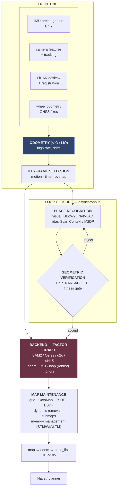

# Chapter 5 — SLAM as a Whole

!!! abstract "Implements"
    **`PlaceRecognition` and `MapMaintenance` (§1.5).** Consumes `Keyframe` and `Values`, produces `LoopCandidate`, robust loop `Factor`s, `MapUpdate`, and the `map→odom` TF edge of §1.7. Rate domain **D**.

## 5.1 Problem statement

**Full (smoothing) SLAM** — the whole trajectory:

$$p(\mathbf{x}_{0:T}, \mathbf{m} \mid \mathbf{z}_{1:T}, \mathbf{u}_{1:T})$$

**Online (filtering) SLAM** — only the current pose:

$$p(\mathbf{x}_t, \mathbf{m}\mid \mathbf{z}_{1:t},\mathbf{u}_{1:t}) = \int p(\mathbf{x}_{0:t},\mathbf{m}\mid\cdot)\ d\mathbf{x}_{0:t-1}$$

Factorized via the Markov assumption:

$$p(\mathbf{x}_{0:T},\mathbf{m}\mid\mathbf{z},\mathbf{u}) \propto p(\mathbf{x}_0)\prod_{t}p(\mathbf{x}_t\mid\mathbf{x}_{t-1},\mathbf{u}_t)\prod_{t}\prod_{k}p(\mathbf{z}_t^k\mid\mathbf{x}_t,\mathbf{m})$$

That product **is** the factor graph of Chapter 3. Every SLAM system is an approximation to this posterior; the taxonomy below is just different approximation strategies.

## 5.2 Taxonomy

**EKF-SLAM.** State = pose + all landmarks. Covariance is dense (landmarks become correlated through the shared pose) → $O(n^2)$ memory and update. Inconsistent for the reasons in §4.5. Historically foundational, practically obsolete.

**FastSLAM / RBPF.** Rao-Blackwellization exploits conditional independence: *given the trajectory*, landmarks are independent.

$$p(\mathbf{x}_{1:t},\mathbf{m}\mid\mathbf{z},\mathbf{u}) = p(\mathbf{x}_{1:t}\mid\mathbf{z},\mathbf{u})\prod_k p(\mathbf{m}_k\mid\mathbf{x}_{1:t},\mathbf{z})$$

Particles carry trajectory hypotheses; each particle carries its own map (EKF per landmark, or a full occupancy grid in `gmapping`). GMapping's two contributions: a **scan-matching-improved proposal** (sample around the scan-match optimum, not the odometry prior, which drastically reduces the particles needed) and **adaptive resampling** triggered on effective sample size $N_{\text{eff}} = 1/\sum \tilde{w}_i^2$. The unavoidable weakness is **particle depletion**: resampling discards trajectory diversity, so old parts of the map cannot be corrected.

**Graph-based SLAM.** The dominant paradigm. Frontend builds constraints; backend optimizes. Everything in Chapters 2–5 is this.

**Pose graph optimization** — the reduced form where landmarks have been marginalized into relative pose constraints:

$$\min_{\{\mathbf{T}_i\}}\ \sum_{(i,j)\in\mathcal{E}}\left\|\mathrm{Log}\!\left(\tilde{\mathbf{T}}_{ij}^{-1}\,\mathbf{T}_i^{-1}\mathbf{T}_j\right)\right\|^2_{\boldsymbol{\Sigma}_{ij}}$$

Cheap, scalable, and the standard target for loop closure. The information loss versus full BA is real but usually acceptable.

## 5.3 The canonical modern pipeline

## 5.4 Data association is the crux

Almost all catastrophic SLAM failures are frontend association failures, not backend optimization failures. The backend's job is to *survive* bad association, not to fix it.

- **Nearest neighbour + Mahalanobis gate**: $d^2 = \mathbf{y}^\top\mathbf{S}^{-1}\mathbf{y} < \chi^2_{\alpha,d}$
- **JCBB** (joint compatibility branch and bound): tests a *set* of associations jointly, which rejects individually-plausible but mutually-inconsistent matches. Exponential worst case, but the branch-and-bound prunes hard in practice.
- **RANSAC** with a minimal solver (P3P, 3-point Kabsch) — the workhorse.
- **Robust backends**: switchable constraints, dynamic covariance scaling, max-mixtures, GNC.
- **Perceptual aliasing** is the enemy: two identical corridors, two identical warehouse aisles. Global descriptors alone cannot resolve it. The defenses are geometric verification, temporal/odometry consistency, and never trusting a single closure.

## 5.5 Map representations

| Representation | Query it answers | Cost | Use |
|---|---|---|---|
| 2D occupancy grid | occupied/free/unknown | $O(A)$ | Nav2 static layer, AMCL |
| OctoMap | 3D occupancy, multi-res | log-odds, sparse | 3D collision |
| Point cloud / submaps | raw geometry | large | LiDAR SLAM maps |
| Surfel | oriented surface patches | medium | SuMa, dense VO |
| TSDF | signed distance near surfaces | voxel hashing | reconstruction |
| **ESDF** | **distance + gradient anywhere** | expensive | **planning, manipulation** |
| Topological / semantic | connectivity, objects | tiny | task planning |

**ESDF is the one that connects SLAM to manipulation.** Occupancy answers "is this cell blocked"; an ESDF answers "how far is the nearest obstacle and in which direction" — which is exactly the query an optimization-based arm planner (CHOMP, TrajOpt) or a whole-body MPC needs, since it wants a gradient to push against. Voxblox and FIESTA are the CPU implementations; **nvblox** is NVIDIA's GPU version, and it feeds a Nav2 costmap layer directly.

Log-odds occupancy update, for completeness:

$$L(m_i\mid z_{1:t}) = L(m_i\mid z_{1:t-1}) + L(m_i\mid z_t) - L(m_i)$$

Additive in log-odds, which is why occupancy grids are cheap — and why an unclamped log-odds value saturates and stops responding to new evidence, the classic reason a map won't forget a person who walked through it. Clamping is what makes forgetting possible.

## 5.6 Dynamic and lifelong operation

The posting-relevant part: a robot navigating around people cannot bake people into its map.

**Removal strategies:** semantic masking of dynamic classes before registration (DynaSLAM-style); visibility-based removal (Removert — a point currently visible through free space cannot be occupied); ground-aware removal (ERASOR); or simply relying on ray-cast free-space updates with properly clamped log-odds.

**Lifelong SLAM:** the map must change without unbounded growth. Techniques: submap-based maps so a region can be re-optimized in isolation; change detection and map versioning; multi-session merging (Atlas-style); and explicit memory management. **RTAB-Map's STM/WM/LTM scheme** is the well-known instance — working memory is bounded by a time budget, locations are transferred to long-term memory by a weighting heuristic and retrieved when a nearby candidate appears, so loop-closure search cost stays bounded regardless of map size.

**Degeneracy handling** (Zhang & Singh): eigen-decompose the scan-matching information matrix $\mathbf{J}^\top\mathbf{J}$; eigenvalues below a threshold indicate unobservable directions (corridor axis, open plane). **Solution remapping** projects the update onto the well-constrained subspace only and lets IMU/wheel odometry carry the rest. This is the principled answer to "what happens in a long empty hallway," and it generalizes: the same eigen-analysis detects a featureless wall in VIO.

## 5.7 Evaluation

**ATE** — global consistency. Align estimated and ground-truth trajectories with $SE(3)$ (or $Sim(3)$ for monocular) via Umeyama, then:

$$\mathrm{ATE}_{\text{RMSE}} = \sqrt{\frac{1}{N}\sum_i\|\mathbf{t}_i^{\text{est,aligned}} - \mathbf{t}_i^{\text{gt}}\|^2}$$

**RPE** — local drift, over a fixed interval $\Delta$:

$$\mathbf{E}_i = \left(\mathbf{T}_i^{\text{gt},-1}\mathbf{T}_{i+\Delta}^{\text{gt}}\right)^{-1}\left(\mathbf{T}_i^{\text{est},-1}\mathbf{T}_{i+\Delta}^{\text{est}}\right)$$

Use `evo` for both. Report **both**: a system with excellent ATE and poor RPE is loop-closing its way out of bad odometry, which looks great on a plot and feels terrible to a controller, because the controller consumes the *local* estimate. This distinction is worth stating explicitly in an interview — it shows you evaluate estimators for their consumer, not for the benchmark.

**Consistency:** NEES needs ground truth (free in Isaac Sim), so use it in simulation; NIS is computable online from innovations, so use it on hardware. A filter whose average NEES sits well above its state dimension is overconfident — and overconfidence is the dangerous direction, because everything downstream believes the covariance.

## 5.8 Failure taxonomy

| Failure | Root cause | Mitigation |
|---|---|---|
| Scale drift (mono) | No metric reference | IMU, stereo, wheel odom, known-size markers |
| Tracking loss | Motion blur, low texture, occlusion | Relocalization, multi-camera, IMU dead reckoning, Atlas |
| Wrong loop closure | Perceptual aliasing | Geometric verification, robust kernels, GNC, odometry consistency |
| Filter overconfidence | Spurious information gain | FEJ / OC-EKF, or use a smoother |
| Degeneracy | Corridor, plane, tunnel | Eigen-analysis + solution remapping |
| Map corruption by dynamics | People in the map | Semantic masking, visibility removal, clamped log-odds |
| `map→odom` jump | Discrete global correction | Two-layer TF (REP-105), smooth the correction, never step the controller |
| Time-sync error | Software timestamps | Hardware trigger, exposure-midpoint stamps, online $t_d$ estimation |
| Extrinsic drift | Compliant mounts, thermal | Rigid mounts first; online calibration only if observable |

## 5.9 The five sentences to be able to say

1. *"SLAM is MAP inference over a factor graph; every system is a different approximation — filtering marginalizes the past, smoothing keeps it, and the choice is a compute-versus-accuracy decision, not a philosophical one."*
2. *"IMU preintegration exists so that relinearizing a pose doesn't force re-integration of the inertial stream, and the bias Jacobians exist so that changing the bias estimate doesn't either."*
3. *"An error-state formulation is not an optimization — it is the only correct way to put a rotation's uncertainty in a covariance matrix, because uncertainty lives in the tangent space."*
4. *"Production estimators are 20% filter and 80% delay compensation, sensor arbitration, gating, and reset logic — which is what reading PX4's EKF2 or ArduPilot's EKF3 actually teaches you."*
5. *"The dangerous failure is not an inaccurate estimate but an overconfident one, because the planner and controller believe the covariance."*
