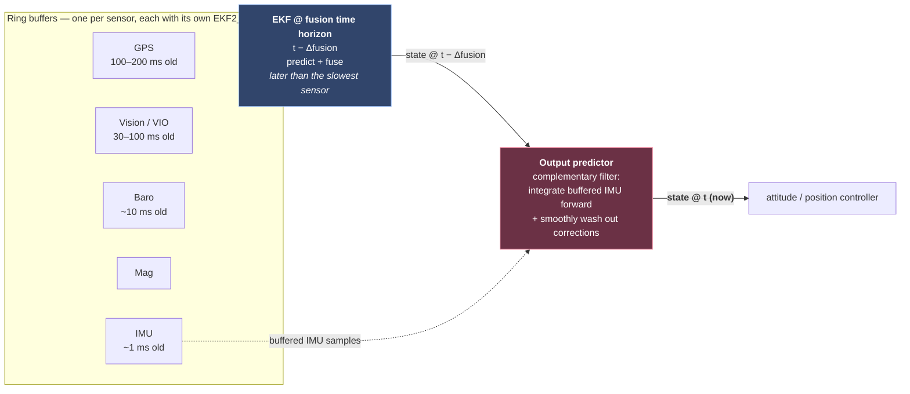
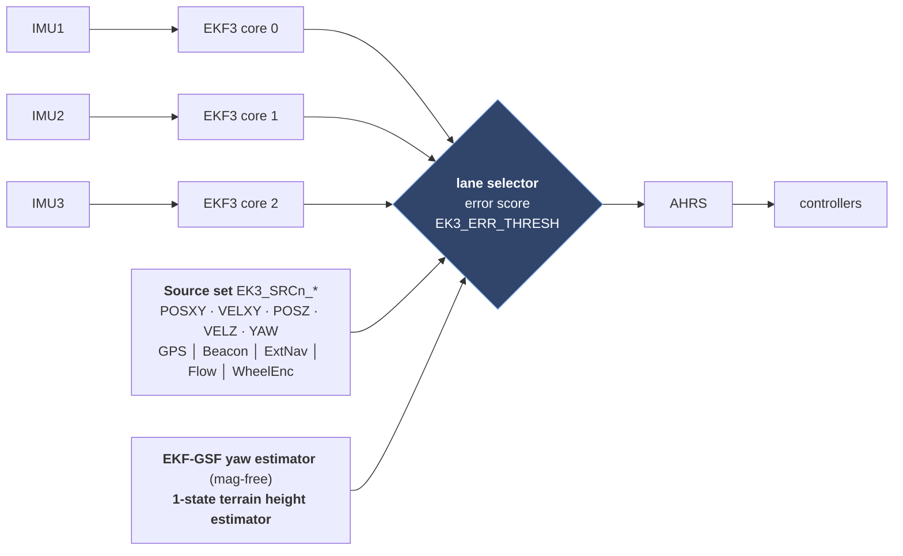
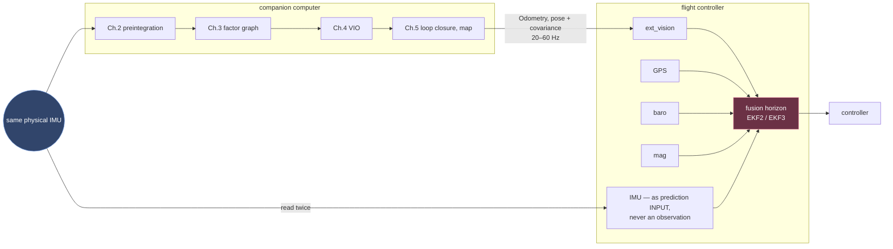

# Chapter 6 — EKF/INS: PX4 EKF2 and ArduPilot EKF3

!!! abstract "Implements"
    **the *other* estimator — it does not implement a §1.4 interface.** It consumes `ImuSample` as a prediction **input** (never an observation) and the `Odometry` of §1.2 as an aiding source. See §1.1 for the two arrows into it, and §6.9 for what that costs.


Both descend from Paul Riseborough's ECL work. Both are 24-element-state, error-state, delay-compensated EKFs. They differ mainly in redundancy management and sensor-source abstraction. Reading either source tree is the fastest way to understand what production INS actually requires beyond the textbook filter.

## 6.1 Generic EKF, and why it's not enough

Prediction and update:

$$\hat{\mathbf{x}}_{k|k-1} = f(\hat{\mathbf{x}}_{k-1}, \mathbf{u}_k), \qquad \mathbf{P}_{k|k-1} = \mathbf{F}\mathbf{P}_{k-1}\mathbf{F}^\top + \mathbf{Q}$$

$$\mathbf{y} = \mathbf{z} - h(\hat{\mathbf{x}}), \quad \mathbf{S} = \mathbf{H}\mathbf{P}\mathbf{H}^\top + \mathbf{R}, \quad \mathbf{K} = \mathbf{P}\mathbf{H}^\top\mathbf{S}^{-1}$$

$$\hat{\mathbf{x}}^+ = \hat{\mathbf{x}} \oplus \mathbf{K}\mathbf{y}, \qquad \mathbf{P}^+ = (\mathbf{I}-\mathbf{K}\mathbf{H})\mathbf{P}$$

Note $\oplus$, not $+$ — the state lives on a manifold.

The textbook stops here. Production needs: delay compensation, sequential scalar fusion, innovation gating, covariance conditioning, sensor arbitration, reset logic, and an output predictor. That's the actual content of the next sections.

## 6.2 Error-state formulation

Split $\mathbf{x} = \hat{\mathbf{x}} \oplus \delta\mathbf{x}$: a **nominal state** integrated with full nonlinearity and no noise, and an **error state** which is small, zero-mean, and carries the covariance.

Why:

1. The rotation error is a minimal 3-vector in $\mathfrak{so}(3)$, so $\mathbf{P}$ is non-singular and correctly interpreted as uncertainty on the tangent space of $SO(3)$.
2. The error is small by construction, so linearization is valid — while the nominal state is arbitrarily large.
3. Jacobians become simple and slowly varying.
4. Rate separation: nominal integrates at IMU rate; covariance propagates at a lower rate.

PX4 confirms exactly this design: the full state vector has **24 elements** while the error state has **23**, because the quaternion contributes 4 elements but only 3 degrees of freedom, and PX4's docs state the error-state formulation exists specifically to describe rotational uncertainty on the tangent space of $SO(3)$ rather than as a 4-D vector. PX4 also derives the covariance prediction and measurement Jacobians symbolically with **SymForce** and generates C, and uses the **Joseph stabilized form** for the covariance update.

**The injection + reset step, which candidates routinely forget:**

$$\hat{\mathbf{q}} \leftarrow \hat{\mathbf{q}} \otimes \begin{bmatrix}1\\ \tfrac{1}{2}\delta\boldsymbol{\theta}\end{bmatrix}, \quad \hat{\mathbf{p}} \leftarrow \hat{\mathbf{p}} + \delta\mathbf{p}, \quad \dots$$

$$\delta\mathbf{x} \leftarrow \mathbf{0}, \qquad \mathbf{P} \leftarrow \mathbf{G}\mathbf{P}\mathbf{G}^\top, \quad \mathbf{G} = \mathrm{blkdiag}(\dots,\ \mathbf{I} - \lfloor\tfrac{1}{2}\delta\hat{\boldsymbol{\theta}}\rfloor_\times,\ \dots)$$

The reset Jacobian $\mathbf{G}$ accounts for the fact that the tangent space has moved. Omitting it is a second-order error — usually survivable, occasionally the reason your yaw covariance is subtly wrong.

## 6.3 PX4 EKF2 — state and structure

24-element state / 23-dim error state:

| Block | Dim (full / error) | Notes |
|---|---|---|
| Quaternion $\mathbf{q}_{nb}$ | 4 / 3 | NED → body |
| Velocity NED | 3 / 3 | |
| Position NED | 3 / 3 | modern PX4 integrates position on the WGS84 ellipsoid (lat/lon/alt) |
| Delta-angle bias | 3 / 3 | units of **rad**, not rad/s |
| Delta-velocity bias | 3 / 3 | units of **m/s** |
| Earth magnetic field NED | 3 / 3 | |
| Body magnetic bias | 3 / 3 | |
| Wind velocity NE | 2 / 2 | |

Plus a **separate 1-state terrain height estimator** (also present in ArduPilot), and an **EKF-GSF yaw estimator** — a bank of EKFs over yaw hypotheses that recovers heading without a magnetometer once there is horizontal acceleration.

**Delta-angle / delta-velocity form.** IMU samples are integrated into $\Delta\boldsymbol{\theta}_k$ and $\Delta\mathbf{v}_k$ before entering the filter (coning/sculling compensation applied here). Then:

$$\mathbf{q}_{k+1} = \mathbf{q}_k \otimes \mathrm{Exp}(\Delta\boldsymbol{\theta}_k - \mathbf{b}_\theta)$$

$$\mathbf{v}_{k+1} = \mathbf{v}_k + \mathbf{R}_k(\Delta\mathbf{v}_k - \mathbf{b}_v) + \mathbf{g}\Delta t$$

$$\mathbf{p}_{k+1} = \mathbf{p}_k + \mathbf{v}_k\Delta t + \tfrac{1}{2}\left[\mathbf{R}_k(\Delta\mathbf{v}_k-\mathbf{b}_v)+\mathbf{g}\Delta t\right]\Delta t$$

Biases on the *integrated* quantities, so they scale with $\Delta t$ implicitly — this is why the parameters are in rad and m/s rather than rates. **The IMU is an input, not a measurement.** PX4's docs are explicit: IMU data is used for state prediction only and never appears as an observation. Every candidate who says "the EKF fuses IMU with GPS" has this backwards, and it matters — it's why there is no IMU $\mathbf{H}$ matrix anywhere in the codebase.

## 6.4 The delayed fusion time horizon — the key architectural idea

Different sensors have different latencies: IMU ~1 ms, baro ~10 ms, GPS 100–200 ms, vision 30–100 ms. Fusing a 150-ms-old GPS fix against a *current* state is simply wrong — you are correcting the present with information about the past.

PX4's solution: **run the EKF at a delayed "fusion time horizon"**, later than the longest sensor delay. Each sensor gets a FIFO ring buffer with a configured delay (`EKF2_*_DELAY`), and data is retrieved from the buffer at the correct time. Then a **complementary filter propagates the delayed state forward to current time** using the buffered IMU data. ArduPilot EKF3 uses the same output-predictor pattern.



The "smoothly wash out corrections" part matters as much as the propagation: when the EKF applies a correction at the fusion horizon, the output predictor must not step the controller's reference. It applies the delta over a time constant instead. This is precisely the same problem as a `map→odom` jump in ROS 2 disturbing a Nav2 controller.

## 6.5 Sequential fusion

Rather than one $m$-dimensional update, fuse measurements **one scalar at a time**:

$$S = \mathbf{H}\mathbf{P}\mathbf{H}^\top + R \quad(\text{scalar}), \qquad \mathbf{K} = \frac{\mathbf{P}\mathbf{H}^\top}{S}, \qquad \delta\mathbf{x} = \mathbf{K}\,y$$

No matrix inversion — a scalar divide. For a 3-axis magnetometer this is three rank-1 updates instead of one 3×3 inversion. It also allows **per-axis rejection**: a bad magnetometer X axis doesn't poison Y and Z. The cost is a mild approximation when measurement noise is correlated across axes, which for these sensors it essentially isn't.

The Jacobians $\mathbf{H}$ are derived symbolically (SymForce in PX4) and code-generated with sparsity exploited — most entries are structurally zero and are never computed. Reading the generated `derivation.py` output is the single most instructive thing in that codebase.

## 6.6 Innovation gating and health

Normalized innovation squared, per measurement:

$$\text{test ratio} = \frac{y^2}{\gamma^2 \cdot S} < 1$$

with $\gamma$ the per-sensor gate (`EKF2_GPS_P_GATE`, `EKF2_HGT_INNOV_GATE`, …). Failing the gate → reject. Failing *persistently* → declare the aid source unhealthy → reset the relevant states to that source, or fall back to another source.

Logging these test ratios is how you debug a real estimator. A test ratio that sits at 0.9 is telling you the sensor is barely passing and your $R$ is optimistic; a ratio that spikes at every turn is telling you about an unmodelled lever arm.

**Covariance conditioning**, every step:

- Force symmetry: $\mathbf{P} \leftarrow \tfrac{1}{2}(\mathbf{P}+\mathbf{P}^\top)$
- Clamp diagonals to $[\sigma^2_{\min}, \sigma^2_{\max}]$
- Reject negative variances (numerical failure indicator)
- Joseph form $\mathbf{P}^+ = (\mathbf{I}-\mathbf{KH})\mathbf{P}(\mathbf{I}-\mathbf{KH})^\top + \mathbf{KRK}^\top$ for stability

## 6.7 ArduPilot EKF3 — what it adds

Same 24-state core. The differences are systems engineering:

**Multiple cores / lane switching.** EKF3 runs one independent filter instance ("lane") per IMU. `EK3_AFFINITY` is a bitmask selecting which sensor types get per-lane affinity (lane 1 → sensor 1, lane 2 → sensor 2, …). Lane errors accumulate relative to the active primary lane, and `EK3_ERR_THRESH` sets how much better a non-primary lane must score before a switch occurs — lower means more aggressive switching. ArduPilot's own docs warn that misconfiguring this can lose the vehicle.

This is a genuine fault-tolerance architecture: N-modular redundancy with a comparator and a voter, at the estimator level. If you have a functional-safety background, this is the natural bridge — it is a fail-operational design, and the lane-error score is the diagnostic.

**Source sets.** `EK3_SRCn_POSXY / VELXY / POSZ / VELZ / YAW` for $n \in \{1,2,3\}$ define complete sensor-source configurations (GPS / Beacon / ExternalNav / OpticalFlow / WheelEncoder / …), switchable at runtime via RC channel, Lua script, or MAVLink. This is the clean solution to indoor/outdoor transitions: not a pile of conditionals, but a declared configuration set with explicit reset semantics on switch.

The failure mode is instructive too: source switching triggers a state reset, and if the reset picks the wrong reference the vehicle jumps. Transition logic between position sources is where the real complexity lives, not in the filter maths.



## 6.8 Pseudocode — the real loop

```
loop @ IMU rate:
    imu = read_imu()
    imu_buffer.push(imu, t_now)

    # coning/sculling → delta angle & delta velocity
    (dTheta, dVel) = downsample_and_correct(imu)

    if time_to_run_fusion_horizon():
        t_fuse = t_now - FUSION_HORIZON_DELAY
        imu_d  = imu_buffer.pop_at(t_fuse)

        # --- prediction (nominal + covariance) ---
        predict_nominal_state(imu_d)          # quaternion/vel/pos
        predict_covariance(imu_d)             # P = F P F' + Q, symbolic F

        # --- fusion, sequentially, only what is due ---
        for src in [gps, baro, mag, rangefinder, flow, ext_vision, airspeed]:
            if src.buffer.has_data_at(t_fuse) and src.is_healthy():
                for axis in src.axes:                # scalar-at-a-time
                    (y, H) = src.innovation_and_jacobian(axis, nominal)
                    S = H @ P @ H.T + src.R[axis]
                    if y*y > src.gate**2 * S:
                        src.reject_count += 1
                        continue
                    K = (P @ H.T) / S
                    dx = K * y
                    inject_and_reset(nominal, dx, P)   # ⊕ then P ← G P G'
                    P = joseph_update(P, K, H, src.R[axis])
                if src.reject_count > LIMIT:
                    reset_states_to(src)  or  fallback_source()

        condition_covariance(P)               # symmetry, clamp, positivity

    # --- output predictor, every cycle ---
    state_now = complementary_filter_propagate(state_at_horizon,
                                               imu_buffer.since(t_fuse))
    publish(state_now)
```

## 6.9 Where the VIO odometry of Chapters 4–5 actually enters

This is the seam between the two halves of this document. Chapters 2–5 build an optimization-based estimator; this chapter is the filter running on the autopilot. On a real vehicle they are chained, not alternatives — the companion computer runs VIO/SLAM, and the flight controller fuses its output as **one aiding source among several**.



The plumbing, concretely:

- **PX4** — vision pose/odometry arrives over uXRCE-DDS or MAVLink (`VehicleOdometry`), and is enabled through `EKF2_EV_CTRL` with `EKF2_EV_DELAY` for its latency, `EKF2_EV_POS_X/Y/Z` for the sensor offset. It is fused at the delayed horizon of §6.4 like any other aiding source.
- **ArduPilot** — the same data becomes the `ExternalNav` option inside the `EK3_SRCn_POSXY / VELXY / YAW` source sets of §6.7, so switching indoor↔outdoor is a source-set switch rather than a code path.

Three consequences that follow directly from earlier sections and are easy to get wrong:

1. **The IMU is read twice, for incompatible purposes.** Chapter 2 treats it as a measurement *between two poses* and solves for both; here it is a control input driving state prediction, with no IMU residual anywhere (§6.3). Both are correct; they are simply different estimators over the same data stream.
2. **The correlation is unmodelled.** VIO's odometry was itself derived from that IMU, so feeding it back to a filter that is *also* integrating that IMU double-counts the information. Nobody models this cross-correlation in practice — which is a real reason to inflate the vision covariance rather than trusting VIO's own $\boldsymbol{\Sigma}$.
3. **Report odometry, not the loop-closed pose.** A loop closure (§5.3) steps the global estimate discontinuously. Fed to the filter that jump is indistinguishable from a genuine measurement and will be gated as an outlier — or worse, accepted. Publish the smooth `odom→base_link` estimate and let the `map→odom` correction stay where REP-105 puts it, exactly as §5.8's failure table says.

## 6.10 What to take from this into a ground-robot context

- The **delayed-horizon + output-predictor** split is the right answer whenever you have heterogeneous sensor latency. `robot_localization` does *not* do this properly, which is a real limitation worth naming.
- **Sequential scalar fusion** is worth adopting for cheap embedded targets.
- **Test ratios logged per sensor** should be your primary estimator debugging tool.
- **Lane/source arbitration** is the production answer to "what happens when a sensor fails," and it's an architecture question, not a filter question.
- Both stacks put **IMU as input, never as observation.** Keep that distinction crisp.
