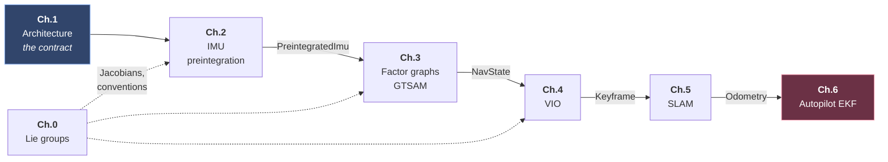

# Principles of Inertial Estimation, VIO, Factor Graphs and SLAM

A working reference: equations, pseudocode, architecture. Written for someone who already knows the vocabulary and wants the derivational spine and the implementation-level detail.

**Contents**

- [Chapter 0 — Lie Group Primer](chapter-0.md)
- [Chapter 1 — System Architecture: components, interfaces, data flow](chapter-1.md)
- [Chapter 2 — IMU Preintegration](chapter-2.md)
- [Chapter 3 — GTSAM and Factor Graphs](chapter-3.md)
- [Chapter 4 — Visual-Inertial Odometry: ORB-SLAM3 and cuVSLAM](chapter-4.md)
- [Chapter 5 — SLAM as a Whole](chapter-5.md)
- [Chapter 6 — EKF/INS: PX4 EKF2 and ArduPilot EKF3](chapter-6.md)
- [References](references.md)

## How to read this

**[Chapter 1](chapter-1.md) is the map.** It defines the components, the interfaces between them, and the type carried on every wire. Every chapter after it decomposes exactly one box, and declares at the top which interface it implements. If a chapter ever seems to appear from nowhere, go back to §1.1 and find its box.

Two threads tie the halves of this document together:

- **Downward** — an IMU factor built in Chapter 2 is consumed as `ImuFactor` in Chapter 3, appears as the inertial term of the VI bundle-adjustment objective in Chapter 4, and is one edge of the pose chain in Chapter 5.
- **Across** — Chapters 2–5 build an *optimization-based* estimator. Chapter 6 is the *filtering* one on the autopilot, and in a real vehicle the two are chained: VIO/SLAM publishes odometry, and EKF2/EKF3 ingests it as an external-vision aiding source alongside GPS, baro and magnetometer. Same IMU, fused twice, for different reasons — see §1.1 and §6.9.

**Notation.** $(\cdot)_W$ world/navigation frame (ENU or NED — stated per chapter), $(\cdot)_B$ body/IMU frame, $(\cdot)_C$ camera frame. $\mathbf{R}_{WB} \in SO(3)$ rotates body vectors into world. $\lfloor \mathbf{v} \rfloor_\times$ is the skew-symmetric matrix. $\tilde{(\cdot)}$ denotes a measurement, $\hat{(\cdot)}$ an estimate, $\bar{(\cdot)}$ a noise-free quantity or one evaluated at the linearization point, and $\delta(\cdot)$ an error.
